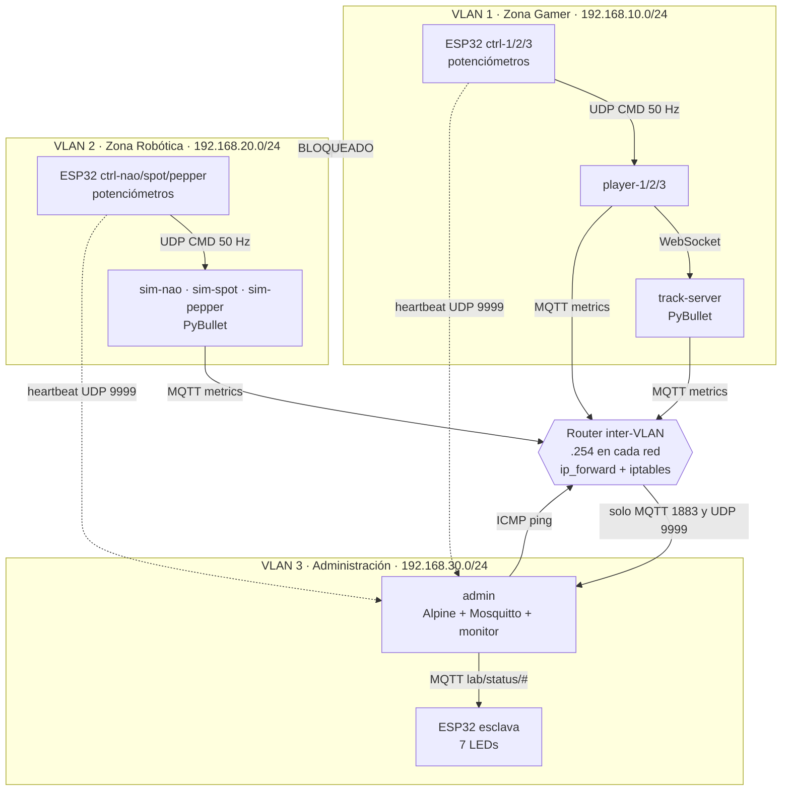
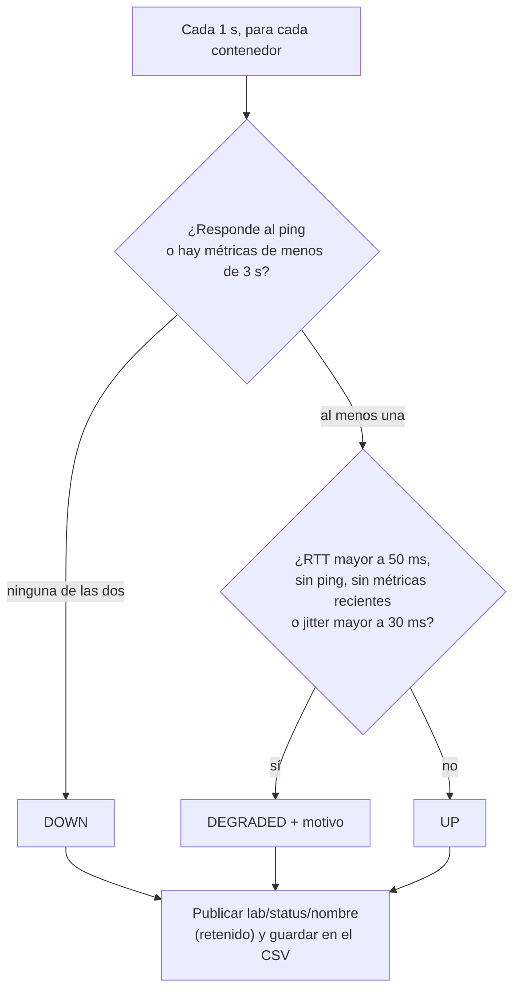
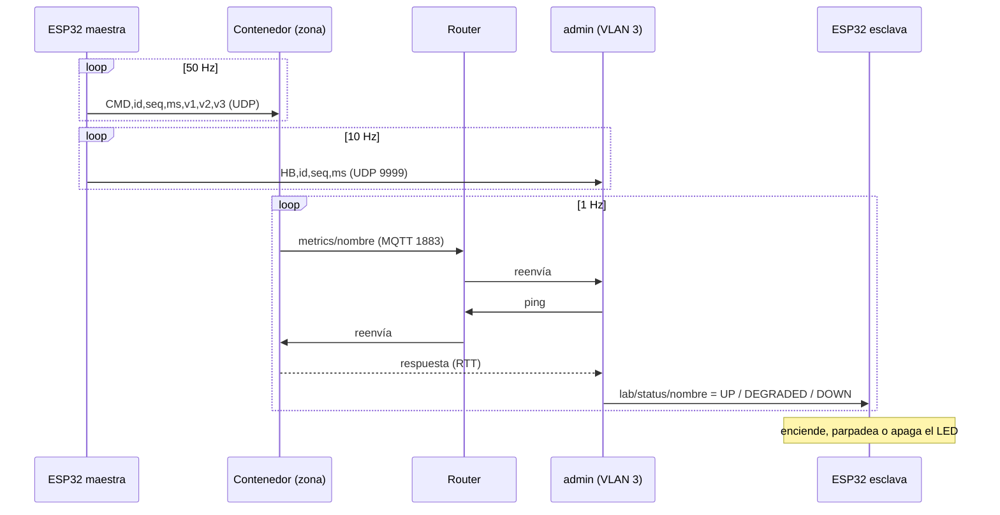

# Zonas virtualizadas de simulación físico-robótica controladas por ESP32 con plano de administración de red

**Trabajo en grupo — Actividad 8, Micros y laboratorio**

**Autores:** Alix Estefania Maldonado Roa · Juan David Artunduaga Diaz · María Fernanda Peñuela Romero
**Repositorio:** https://github.com/mafer1608-7/Actividad-8 · **Fecha:** 7 de octubre de 2026

Un conjunto de ESP32 controla en tiempo real dos zonas de simulación física que corren en **contenedores Docker** y están aisladas entre sí en **VLANs**: una zona de **carreras multijugador** y una zona de **robótica** (Spot, Pepper y NAO). Un tercer segmento, el **plano de administración**, mide la latencia, el jitter y la disponibilidad de cada contenedor, y una ESP32 esclava muestra el estado de cada uno con **LEDs**. Un **router inter-VLAN** deja que el plano de administración observe ambas zonas sin romper su aislamiento. Todo sigue un patrón **maestro–esclavo** entre los dispositivos embebidos.

| Parte | Qué hace | Hardware | Software |
|---|---|---|---|
| **VLAN 1 — Zona Gamer** | Servidor de pista con 3 coches y 3 clientes, cada uno controlado por una ESP32 maestra | 3 ESP32 con potenciómetros | PyBullet + WebSocket, en Docker |
| **VLAN 2 — Zona Robótica** | Spot, Pepper y NAO en contenedores independientes, cada uno movido por su ESP32 maestra (*real-to-sim*) | 3 ESP32 con potenciómetros | PyBullet, en Docker |
| **VLAN 3 — Administración** | Mide latencia, jitter, pérdida y disponibilidad; publica el estado de cada contenedor; panel web | 1 ESP32 esclava con 7 LEDs | Alpine + Mosquitto + monitor propio, en Docker |
| **Router inter-VLAN** | Une las 3 redes y solo deja pasar el tráfico necesario | — | Alpine + iptables, en Docker |

**Estado de la validación** (detalle en la [sección 7](#7-resultados)):

| | Estado |
|---|---|
| Lógica de clasificación `UP` / `DEGRADED` / `DOWN` | Comprobada con pruebas locales: RTT bajo → `UP`, RTT de 120 ms → `DEGRADED`, sin ping ni métricas → `DOWN` |
| Estimador de jitter | Comprobado con 50 paquetes enviados cada ~25 ms con retardo aleatorio de hasta 10 ms: 0 pérdidas y jitter estimado de 4.9 ms |
| Sistema completo en Docker (aislamiento, latencia, jitter, disponibilidad) | Procedimiento y resultados esperados definidos; mediciones pendientes de ejecutar |
| Firmware en ESP32 físicas | Escrito, pero no probado físicamente (no se dispuso de las placas); se valida con ESP32 virtuales |

---

## Contenido

1. [Arquitectura general](#1-arquitectura-general)
2. [Las zonas: qué hacen y cómo se ven](#2-las-zonas-qué-hacen-y-cómo-se-ven)
3. [El plano de administración: cómo se mide la red](#3-el-plano-de-administración-cómo-se-mide-la-red)
4. [Red y protocolos de comunicación](#4-red-y-protocolos-de-comunicación)
5. [Simulaciones en PyBullet y Docker](#5-simulaciones-en-pybullet-y-docker)
6. [Análisis](#6-análisis)
7. [Resultados](#7-resultados)
8. [Materiales y software](#8-materiales-y-software)
9. [Explicación del código](#9-explicación-del-código)
10. [Problemas comunes y soluciones](#10-problemas-comunes-y-soluciones)
11. [Conclusiones](#11-conclusiones)
12. [Referencias](#12-referencias)

---

## 1. Arquitectura general

Las **ESP32 maestras** generan las órdenes de control; los **contenedores** simulan la física; el **plano de administración** observa, mide y decide el estado de cada contenedor; la **ESP32 esclava** lo muestra con LEDs. El PC con Docker aloja las tres redes y el router.



Cada zona es autónoma: si el plano de administración se apaga, las simulaciones siguen funcionando; solo se pierde la medición y la señalización. Si un contenedor cae, el administrador lo detecta en pocos segundos y su LED se apaga.

---

## 2. Las zonas: qué hacen y cómo se ven

### 2.1 Qué hace cada zona

**VLAN 1 — Zona Gamer Multijugador**

1. Cada ESP32 maestra lee tres potenciómetros y envía por UDP un paquete de control a 50 Hz a su contenedor `player`.
2. El `player` convierte el primer valor en **dirección** (el centro es recto) y el segundo en **acelerador**, y lo reenvía por WebSocket al `track-server`.
3. El `track-server` simula en PyBullet una pista elíptica con **3 coches**. Cada `player` puede configurar el **color** y el **estilo** de su coche (`sport`, `classic` o `drift`, que cambian la ganancia de velocidad).
4. Si una ESP32 deja de enviar más de 1 s, su coche pasa a **piloto automático** y sigue la pista por waypoints: son los "carros autónomos" del servidor.

**VLAN 2 — Zona de Simulación Robótica**

1. Cada robot (Spot, Pepper y NAO) vive en su propio contenedor, con su propio simulador PyBullet.
2. Cada ESP32 maestra envía tres valores analógicos (0 a 4095). El simulador los asigna a **tres grupos de articulaciones** del robot y fija su posición objetivo entre los límites de cada articulación.
3. Es el paradigma ***real-to-sim***: al girar un potenciómetro real, el robot simulado se mueve de forma equivalente.

**VLAN 3 — Plano de administración**

1. El contenedor `admin` hace ping a los 7 contenedores cada segundo y escucha sus métricas por MQTT y los heartbeats de las ESP32 maestras.
2. Con eso calcula latencia, jitter, pérdida y disponibilidad, clasifica cada contenedor y publica su estado.
3. La **ESP32 esclava** está suscrita a esos estados y enciende, hace parpadear o apaga el LED de cada contenedor.
4. El `admin` guarda cada muestra en un archivo CSV y ofrece un **panel web** en `http://localhost:8080`.

**Router inter-VLAN.** Es el único punto de paso entre redes. Aplica una política de "todo bloqueado, salvo lo necesario" (sección 4.3).

### 2.2 Indicadores LED de la ESP32 esclava

Hay 7 LEDs, uno por contenedor monitoreado:

| LED | GPIO | Contenedor |
|---|---|---|
| 1 | 13 | track-server |
| 2 | 14 | player-1 |
| 3 | 16 | player-2 |
| 4 | 17 | player-3 |
| 5 | 18 | sim-nao |
| 6 | 19 | sim-spot |
| 7 | 21 | sim-pepper |

| Comportamiento del LED | Significado |
|---|---|
| **Encendido fijo** | `UP`: contenedor sano |
| **Parpadeo lento** (2 Hz) | `DEGRADED`: latencia o jitter altos, o faltan métricas |
| **Apagado** | `DOWN`: sin respuesta |
| **Todos parpadean rápido** (5 Hz) | La esclava perdió la conexión con el broker MQTT |
| Barrido de los 7 LEDs al encender | Prueba de que todos funcionan |

Si la esclava no recibe un estado de un contenedor en 5 s, lo considera `DOWN`. En las ESP32 maestras, el LED integrado (GPIO 2) se enciende cuando hay Wi-Fi.

### 2.3 Direccionamiento

| Red | Subred | Contenedores | Puertos publicados en el PC |
|---|---|---|---|
| VLAN 1 Gamer | 192.168.10.0/24 | track-server `.10`, player-1 `.11`, player-2 `.12`, player-3 `.13`, router `.254` | UDP 5001, 5002, 5003 |
| VLAN 2 Robótica | 192.168.20.0/24 | sim-nao `.11`, sim-spot `.12`, sim-pepper `.13`, router `.254` | UDP 5011, 5012, 5013 |
| VLAN 3 Admin | 192.168.30.0/24 | admin `.10`, router `.254` | TCP 1883 (MQTT), UDP 9999 (heartbeat), TCP 8080 (panel) |

Cada VLAN es una **red bridge de Docker** independiente, con su propia subred y su propio dominio de broadcast. Como alternativa, pueden crearse VLAN 802.1Q reales con redes `macvlan` sobre subinterfaces (`eth0.10`, `eth0.20`, `eth0.30`); no es la configuración por defecto.


## 3. El plano de administración: cómo se mide la red

### 3.1 Qué se mide

| Métrica | Cómo se obtiene |
|---|---|
| **Latencia** | Tiempo de ida y vuelta (RTT) de un `ping` ICMP a cada contenedor, una vez por segundo |
| **Jitter** | Variación del tiempo entre paquetes consecutivos, con el estimador de la RFC 3550 sobre los flujos UDP |
| **Pérdida** | Huecos en el número de secuencia de los paquetes |
| **Disponibilidad** | Porcentaje de pings respondidos en las últimas 300 muestras (unos 5 minutos) |
| **Actividad** | Métricas que cada contenedor publica por MQTT: tasa de paquetes, jitter propio y frecuencia de simulación |

### 3.2 Estimador de jitter

Cada paquete de control lleva un número de secuencia `S` y la marca de tiempo del emisor `t` (los milisegundos de la ESP32). Para cada paquete recibido en el instante `r`, se compara cuánto tardó en llegar respecto al anterior con cuánto tardó en enviarse:

```
D(i) = | (r_i − r_(i−1)) − (t_i − t_(i−1)) |
J    ← J + (D − J) / 16
```

Así no hace falta que los relojes de la ESP32 y del PC estén sincronizados: solo importan las **diferencias**. Si los paquetes llegan con el mismo espaciado con que salieron, `D = 0` y el jitter es 0. El factor 1/16 suaviza el valor, para que un paquete aislado no lo dispare. Si el número de secuencia retrocede (la ESP32 se reinició), se reinicia la referencia sin contar un falso jitter. Las pérdidas se cuentan sumando los saltos de secuencia.

### 3.3 Clasificación del estado



Los umbrales (RTT 50 ms, jitter 30 ms, métricas 3 s) se pueden cambiar con variables de entorno del contenedor `admin`. El motivo (`latencia-alta`, `jitter-alto`, `sin-ping`, `sin-metricas`) se muestra en el panel.

---

## 4. Red y protocolos de comunicación

### 4.1 Protocolos

| Enlace | Protocolo | Formato | Frecuencia |
|---|---|---|---|
| ESP32 maestra → contenedor | UDP | `CMD,id,seq,ms,v1,v2,v3` | 50 Hz |
| ESP32 maestra → admin | UDP (puerto 9999) | `HB,id,seq,ms` | 10 Hz |
| `player` → `track-server` | WebSocket | JSON `{player, steer, throttle, color, style, gain}` | 30 Hz |
| Contenedor → admin | MQTT `metrics/<nombre>` | JSON con tasa, pérdidas, jitter y frecuencia de simulación | 1 Hz |
| admin → ESP32 esclava | MQTT `lab/status/<nombre>` | `UP`, `DEGRADED` o `DOWN` (mensaje retenido) | 1 Hz |
| admin → panel web | MQTT `lab/metrics/<nombre>` y HTTP | JSON con todas las métricas | 1 Hz |
| admin → contenedores | ICMP | `ping` | 1 Hz |

Se usa **UDP** para el control porque el dato más reciente siempre reemplaza al anterior: un paquete perdido no justifica una retransmisión que retrasaría los siguientes. Se usa **MQTT** para la telemetría y el estado porque es un esquema de publicación y suscripción: la ESP32 esclava solo se suscribe y no necesita conocer a nadie. El estado se publica **retenido**, así que la esclava recibe el último valor apenas se conecta.



### 4.2 Cómo llegan los paquetes a un contenedor

Las ESP32 están en la red local y los contenedores en redes internas de Docker. Por eso cada contenedor **publica un puerto UDP** en el PC (por ejemplo, 5001 para `player-1`), y las ESP32 envían sus paquetes a la IP del PC en ese puerto. Docker los entrega al contenedor correspondiente.

### 4.3 Aislamiento y política del router

El router es un contenedor conectado a las tres redes (`.254` en cada una), con el reenvío de IP activado y la política `FORWARD DROP`: lo que no está permitido explícitamente, se descarta.

| Origen → Destino | Política |
|---|---|
| VLAN 1 ↔ VLAN 2 | **Bloqueado**: no hay ninguna regla que lo permita |
| VLAN 3 → VLAN 1 y VLAN 2 | Solo **ICMP echo** (latencia y disponibilidad) |
| VLAN 1 y VLAN 2 → admin | Solo **MQTT 1883/tcp** y **heartbeat 9999/udp** |
| Respuestas de conexiones ya establecidas | Permitidas |
| Cualquier otro tráfico | Bloqueado |

Cada contenedor instala al arrancar rutas estáticas hacia las otras subredes a través del router (por ejemplo, un `player` envía lo destinado a 192.168.30.0/24 por 192.168.10.254). Así el plano de administración observa ambas zonas "sin romper su aislamiento": las zonas no se ven entre sí, y hacia el administrador solo pasan dos puertos.

---

## 5. Simulaciones en PyBullet y Docker

### 5.1 Zona Gamer

- **Servidor de pista:** PyBullet sin ventana, a 240 Hz en tiempo real. Una pista elíptica de 10 m × 6 m marcada con 48 waypoints, y 3 coches del modelo `racecar` de `pybullet_data`.
- **Control:** cada coche recibe velocidad de las ruedas (acelerador) y ángulo de las ruedas delanteras (dirección).
- **Piloto automático:** si un jugador no envía comandos durante 1 s, su coche busca el waypoint más cercano, apunta a 3 waypoints adelante y corrige el rumbo con un controlador proporcional, a velocidad moderada.
- **Clientes:** cada `player` recibe UDP de su ESP32, lo convierte (zona muerta de 5 % en la dirección, acelerador de 0 a 1) y lo reenvía por WebSocket. Si pierde la conexión con el servidor, reintenta cada segundo. Su color (`CAR_COLOR`) y estilo (`CAR_STYLE`) son configurables.

### 5.2 Zona Robótica

- Tres contenedores, cada uno con **un robot** y **su propia ESP32**: Spot (cuadrúpedo), NAO (humanoide pequeño) y Pepper (humanoide grande).
- Se detectan las articulaciones rotacionales del modelo y se reparten en **tres grupos**. Cada valor analógico de la ESP32 (0–4095) fija la posición objetivo de su grupo, entre los límites de cada articulación.
- Por defecto el robot está **sujeto por la base**, para que no se caiga y se aprecie bien el movimiento (se puede liberar con `FIX_BASE=0`).
- Modelos: por defecto se usan los de `pybullet_data` (`a1` para Spot y `humanoid`, escalado, para NAO y Pepper). Los repositorios de referencia se pueden usar montando sus modelos URDF en el contenedor:

| Referencia | Aporta |
|---|---|
| [rl-baselines3-zoo](https://github.com/DLR-RM/rl-baselines3-zoo) | Pista de carros con PyBullet |
| [rex-gym](https://github.com/nicrusso7/rex-gym) | Cuadrúpedo (Spot) |
| [humanoid-gym](https://github.com/0aqz0/humanoid-gym) | Humanoides (NAO y Pepper) |

### 5.3 Por qué Docker

Cada simulación necesita PyBullet, NumPy y sus dependencias. Con Docker, los 3 integrantes ejecutan exactamente lo mismo sin instalar ni resolver versiones. Se construye una **imagen base** con PyBullet (que se compila una sola vez) y todas las imágenes de simulación parten de ella. El archivo `docker-compose.yml` crea las tres redes, asigna IP fijas, publica los puertos y levanta los 9 contenedores.

### 5.4 ESP32 virtuales

Como no se dispuso de las placas, se escribió un **emulador de ESP32 maestra** que envía exactamente los mismos paquetes (`CMD` a 50 Hz y `HB` a 10 Hz) que el firmware real, con señales senoidales en lugar de potenciómetros. Permite validar todo el laboratorio y, además, **inyectar jitter y pérdidas** a voluntad. Además, el router incluye `tc`, que permite añadir latencia y jitter a una VLAN para los experimentos.

---

## 6. Análisis

### 6.1 Ancho de banda

Estimaciones por tamaño de trama (sin cabeceras de red):

| Flujo | Tamaño aprox. | Frecuencia | Por dispositivo |
|---|---|---|---|
| `CMD` (ESP32 → contenedor) | 40 B | 50 Hz | ≈ 2 KB/s |
| `HB` (ESP32 → admin) | 22 B | 10 Hz | ≈ 0.2 KB/s |
| Métricas MQTT (contenedor → admin) | ≈ 250 B | 1 Hz | ≈ 0.25 KB/s |
| Estado y métricas (admin → MQTT) | ≈ 350 B por contenedor | 1 Hz | ≈ 2.5 KB/s en total |

Las 6 ESP32 maestras generan unos 13 KB/s hacia los contenedores, y el administrador unos 4 KB/s: **menos de 0.2 Mbit/s en total**. Una red Wi-Fi 802.11n mueve varios Mbit/s, así que la red queda muy por debajo de su capacidad.

### 6.2 Qué se espera del jitter

Las ESP32 envían cada 20 ms. En una red local sin carga, el jitter debería ser de unos pocos milisegundos, y por eso el umbral de `DEGRADED` se fijó en 30 ms (más que una vez y media el periodo de envío). Si se inyectan retardos aleatorios de hasta 80 ms, el estimador debe superar ese umbral, y es lo que se verifica en el experimento E3.

### 6.3 Por qué la clasificación usa varias señales

Un solo indicador no basta. Un contenedor puede responder al ping y aun así tener la simulación detenida (se detecta por la falta de métricas), o publicar métricas pero con la red lenta (se detecta por el RTT). `DOWN` exige que **fallen ambas señales**; con una sola falla, el contenedor queda en `DEGRADED` con el motivo explicado.

### 6.4 Seguridad del aislamiento

Docker ya impide el tráfico directo entre redes bridge distintas. El router añade una **política explícita y verificable**: la política por defecto descarta, y solo se abren tres excepciones (ICMP del administrador, MQTT y heartbeat hacia el administrador). Esto se comprueba con el ping bloqueado entre VLAN 1 y VLAN 2 y con los contadores de `iptables`.

### 6.5 Limitaciones

El broker MQTT es anónimo y sin cifrado, adecuado para un laboratorio. Las "VLAN" son redes bridge de Docker, equivalentes lógicas a VLAN pero sin etiquetas 802.1Q. La latencia medida es la de las redes virtuales del PC, que es mucho menor que la de una red Wi-Fi real.

---

## 7. Resultados

### 7.1 Comprobaciones realizadas durante el desarrollo

Pruebas locales de la lógica del administrador y del estimador de jitter (sin Docker ni ESP32):

| Prueba | Entrada | Resultado |
|---|---|---|
| Clasificación | Ping de 3.2 ms y métricas recientes | `UP` |
| Clasificación | Ping de 120 ms | `DEGRADED` |
| Clasificación | Sin ping y sin métricas | `DOWN` |
| Estimador de jitter | 50 paquetes con periodo base de 20 ms y retardo aleatorio de 0 a 10 ms | 50 recibidos, 0 perdidos, jitter estimado de 4.9 ms |

### 7.2 Comportamiento esperado según el diseño

No son mediciones: se deducen de los umbrales configurados (latencia superior a 50 ms o jitter superior a 30 ms → `DEGRADED`; sin ping y sin métricas → `DOWN`).

| Experimento | Contenedor | Condición aplicada | Estado esperado | LED esperado |
|---|---|---|---|---|
| E0 Aislamiento | — | Ping entre VLAN 1 y VLAN 2 | Bloqueado | — |
| E1 Línea base | player-1 | Sin perturbaciones | `UP` | Fijo |
| E2 Latencia | sim-nao | 100 ms ± 20 ms de retardo en la VLAN 2 | `DEGRADED` (latencia alta) | Parpadeo lento |
| E3 Jitter y pérdida | player-1 | Jitter de hasta 80 ms y 10 % de paquetes perdidos | `DEGRADED` (jitter alto) | Parpadeo lento |
| E4 Disponibilidad | sim-spot | Contenedor detenido | `DOWN`, y `UP` al reiniciarlo | Apagado, luego fijo |

### 7.3 Resultados medidos

_Pendiente de ejecutar los experimentos de la sección 7.2. Se completa con la salida del análisis de métricas (RTT, jitter y disponibilidad por contenedor)._

| Experimento | Contenedor | RTT medio (ms) | RTT p95 (ms) | Jitter medio (ms) | Disponibilidad (%) | Estado observado |
|---|---|---|---|---|---|---|
| E1 | player-1 | | | | | |
| E2 | sim-nao | | | | | |
| E3 | player-1 | | | | | |
| E4 | sim-spot | | | | | |

### 7.4 Posibles mejoras

- **Probar el firmware en las ESP32 físicas** y comparar la latencia y el jitter reales por Wi-Fi con los de las redes virtuales.
- **Usar los modelos originales** de los repositorios de referencia (rex-gym y humanoid-gym) para Spot, NAO y Pepper.
- **Entrenar un agente de aprendizaje por refuerzo** con rl-baselines3-zoo para los coches autónomos, en lugar del controlador por waypoints.
- **Seguridad:** usuarios, permisos y TLS en el broker MQTT.
- **Enrutamiento dinámico** con FRR en el router y **VLAN 802.1Q reales** con `macvlan`.
- **Visualización:** paneles de Grafana sobre el CSV de métricas.

---

## 8. Materiales y software

| Material | Cantidad | Uso |
|---|---|---|
| ESP32 DevKit | 7 | 6 maestras (3 por zona) y 1 esclava |
| Potenciómetros de 10 kΩ | 18 (3 por maestra) | Entradas de control |
| LED | 7 | Estado de cada contenedor |
| Resistencias de 220 Ω | 7 | Una por LED |
| Protoboard, cables Dupont y cables USB de datos | los necesarios | Montaje y alimentación |
| PC con Docker y Wi-Fi 2.4 GHz | 1 | Contenedores, router y plano de administración |

**Conexiones de cada ESP32 maestra:** potenciómetros en GPIO 34, 35 y 32 (un extremo a 3V3, el otro a GND y el cursor al GPIO). **ESP32 esclava:** cada LED en su GPIO (tabla de la sección 2.2) a través de una resistencia de 220 Ω, con el otro extremo a GND.

| Software | Para qué |
|---|---|
| Docker Desktop (motor WSL 2) y Docker Compose | Contenedores, redes y router |
| VS Code + PlatformIO (Arduino) | Firmware de las ESP32 |
| PyBullet 3.2.6 | Simulación física |
| Python 3.10 en las imágenes (NumPy, paho-mqtt, websockets) | Simuladores y clientes |
| Alpine Linux 3.20, Mosquitto, iptables, iproute2 | Plano de administración y router |
| Python 3 en el PC (opcional) | Emulador de ESP32 y análisis de métricas |

---

## 9. Explicación del código

### 9.1 ESP32 maestra

Un bucle sin bloqueos reparte el tiempo entre dos envíos: el comando de control cada 20 ms y el heartbeat cada 100 ms. Antes de enviar, promedia cuatro lecturas de cada potenciómetro para filtrar el ruido, y desactiva el ahorro de energía del Wi-Fi para reducir el jitter:

```cpp
WiFi.setSleep(false);                              // menos jitter
...
if (now - lastCmd >= 20) {
  lastCmd += 20;
  snprintf(buf, sizeof(buf), "CMD,%s,%lu,%lu,%d,%d,%d", DEVICE_ID, seqCmd++, now,
           readAvg(PIN_A), readAvg(PIN_B), readAvg(PIN_C));
  // se envía por UDP al puerto del contenedor
}
```

Todas las maestras llevan el mismo código; solo cambian el identificador y el puerto de destino, que se definen al compilar con un entorno distinto por placa.

### 9.2 ESP32 esclava

Se conecta al Wi-Fi, luego al broker MQTT y se suscribe a `lab/status/#`. Al llegar un mensaje, toma el nombre del contenedor del final del tópico y actualiza su estado. En cada vuelta del bucle decide el LED sin bloquear:

```cpp
on = s == S_UP ? true
   : (s == S_DEGRADED ? (now / 250) % 2 : false);    // fijo / parpadeo / apagado
```

Si no recibe un estado en 5 s, o pierde el broker, lo indica con el parpadeo correspondiente.

### 9.3 Estimador de jitter

Una clase pequeña, compartida por el administrador y los simuladores, guarda el instante de llegada y la marca del emisor del paquete anterior:

```python
d = abs((arr - self.last_arr) - (sender_ms - self.last_snd))
self.jitter += (d - self.jitter) / 16.0
```

También cuenta pérdidas por saltos en la secuencia y mide la tasa de paquetes en una ventana deslizante de 2 s.

### 9.4 Simuladores

- **Servidor de pista:** crea el mundo, los 3 coches y la pista; en cada ciclo aplica los comandos de cada jugador (o el piloto automático) y avanza la física. Publica cada segundo su frecuencia de simulación y el modo de cada coche.
- **Cliente `player`:** recibe UDP en un puerto, calcula dirección y acelerador, y mantiene la conexión WebSocket con el servidor, con reintentos.
- **Simulador de robot:** carga el modelo, agrupa sus articulaciones en tres y, a 30 Hz, aplica la posición objetivo que dicen los tres valores recibidos. Un hilo aparte escucha el UDP para no frenar la física.

Todos publican su propio jitter y su tasa por MQTT, que el administrador cruza con el ping.

### 9.5 Administrador

Cuatro hilos independientes: el que lanza los 7 pings en paralelo cada segundo, el que escucha los heartbeats UDP, el cliente MQTT que recibe las métricas, y el que cada segundo calcula el estado, lo publica y lo guarda. El panel web es un servidor HTTP mínimo que muestra la tabla y se refresca solo.

### 9.6 Router

Un contenedor Alpine que, al arrancar, activa el reenvío de IP y carga las reglas: política por defecto descartar, aceptar las conexiones ya establecidas, aceptar solo el ping del administrador y solo MQTT y heartbeat hacia él:

```sh
iptables -P FORWARD DROP
iptables -A FORWARD -m conntrack --ctstate ESTABLISHED,RELATED -j ACCEPT
iptables -A FORWARD -s 192.168.30.0/24 -d 192.168.10.0/24 -p icmp --icmp-type echo-request -j ACCEPT
iptables -A FORWARD -s 192.168.10.0/24 -d 192.168.30.10 -p tcp --dport 1883 -j ACCEPT
```

---

## 10. Problemas comunes y soluciones

| Problema | Causa y solución |
|---|---|
| `Pool overlaps with other one` | Tu red local usa las mismas subredes: cambiarlas en la configuración de Docker, del router y del administrador |
| Todos en `DOWN` al iniciar | El administrador necesita unos 5 s para medir; esperar |
| `DEGRADED` con `sin-metricas` | Fallan las rutas o las reglas del router: revisar `docker exec router iptables -L FORWARD -nv` |
| `docker` no se reconoce | Docker Desktop no está abierto o instalado; esperar a "Engine running" |
| La ESP32 no llega al contenedor | IP del PC incorrecta o firewall de Windows: abrir los puertos UDP y probar antes con las ESP32 virtuales |
| `iptables` falla en el router | El kernel del equipo no tiene `nf_conntrack`: usar `iptables-legacy` en el router |
| El coche gira o avanza al revés | El signo depende del modelo: invertirlo en la aplicación de los controles |
| No se encuentra el modelo `a1` | La versión de `pybullet_data` no lo incluye: usar un modelo de los repositorios de referencia |
| Error de puerto ocupado al cargar el firmware | Otro programa usa el puerto serie: cerrar los monitores serie |
| Un LED no enciende | Revisar el GPIO, la polaridad del LED (pata larga al GPIO) y la resistencia |

---

## 11. Conclusiones

- Se integraron en una sola arquitectura contenedores Docker, redes segmentadas, simulación física y microcontroladores, siguiendo un patrón maestro–esclavo: las ESP32 maestras controlan cada simulación en tiempo real y la ESP32 esclava refleja el estado calculado por el administrador.
- Un router con política de "todo bloqueado salvo lo necesario" permite que el plano de administración observe ambas zonas sin que estas puedan verse entre sí, y solo se abren tres excepciones: ping, MQTT y heartbeat.
- Medir la red con varias señales (ping, heartbeat y métricas de cada contenedor) permite distinguir entre un contenedor lento, uno degradado y uno caído, y explicar el motivo.
- El estimador de jitter de la RFC 3550 no necesita relojes sincronizados, ya que compara diferencias, lo que lo hace adecuado para microcontroladores y PC con relojes distintos.
- Contar con ESP32 virtuales que hablan el mismo protocolo que el firmware permitió validar la lógica y planear los experimentos sin las placas físicas, aunque las mediciones con hardware real quedan como trabajo pendiente.
- Docker garantiza que todo el laboratorio se reproduce igual en cualquier equipo con un par de comandos.

---

## 12. Referencias

- Schulzrinne, H., Casner, S., Frederick, R., & Jacobson, V. (2003). *RTP: A Transport Protocol for Real-Time Applications*, RFC 3550 (estimador de jitter).
- OASIS. *MQTT Version 3.1.1*, y Eclipse Mosquitto. https://mosquitto.org
- Coumans, E., & Bai, Y. *PyBullet, a Python module for physics simulation for games, robotics and machine learning*. https://pybullet.org
- Docker Inc. *Docker Compose* y *Networking overview*. https://docs.docker.com
- Netfilter Project. *iptables* y `tc-netem` (emulación de red).
- Espressif Systems. Documentación de Arduino-ESP32 (Wi-Fi y ADC).
- Raffin, A. et al. *RL Baselines3 Zoo*. https://github.com/DLR-RM/rl-baselines3-zoo
- Russo, N. *rex-gym*. https://github.com/nicrusso7/rex-gym
- *humanoid-gym*. https://github.com/0aqz0/humanoid-gym
