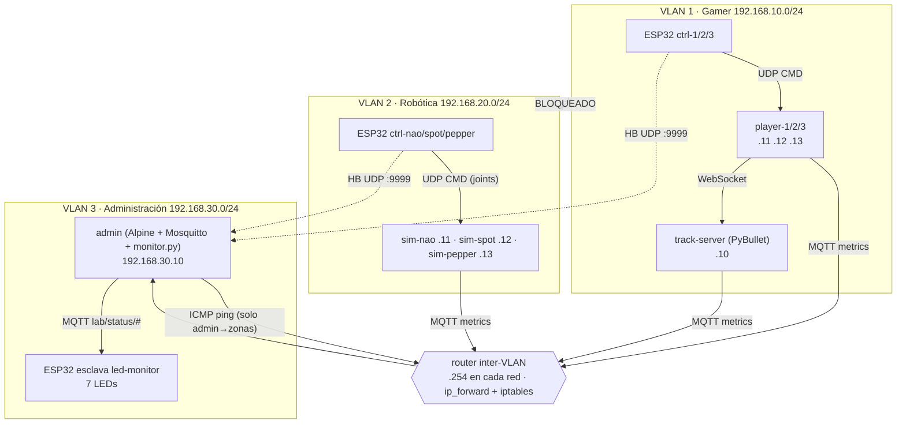

# Zonas Virtualizadas de Simulación Físico-Robótica Controladas por ESP32 con Plano de Administración de Red

> Laboratorio con **ESP32 + PyBullet + Docker + VLANs + MQTT**: dos zonas de simulación aisladas entre sí
> (carreras multijugador y robótica), un plano de administración que mide jitter, latencia y disponibilidad,
> y una ESP32 esclava que refleja el estado de cada contenedor con LEDs.

**Autor(es):** _<tu nombre / grupo>_ · **Curso:** _<curso>_ · **Fecha:** _<fecha>_
**Imágenes Docker Hub:** `<tu_usuario>/lab-*` (ver [sección 9](#9-imágenes-en-docker-hub)) · **Video:** _<enlace>_

---

## 1. Objetivos

**General.** Diseñar e implementar una arquitectura distribuida basada en contenedores Docker, segmentada en VLANs, donde varias
ESP32 actúan como dispositivos de control en tiempo real sobre simulaciones PyBullet, y donde un plano de administración
independiente mide jitter, latencia y estado de cada zona, reflejando la actividad de los contenedores mediante LEDs
controlados por una ESP32 esclava.

| # | Objetivo específico | Dónde se cumple |
|---|---|---|
| 1 | VLAN 1 (Gamer): servidor de pista PyBullet + 3 clientes, cada uno controlado por una ESP32 maestra | `services/track_server`, `services/player`, `firmware/src/ctrl` |
| 2 | VLAN 2 (Robótica): Spot, Pepper y NAO en PyBullet, cada uno con su ESP32 maestra (*real-to-sim*) | `services/robot_sim`, `firmware/src/ctrl` |
| 3 | VLAN 3 (Administración): contenedor Alpine de monitoreo, broker MQTT y ESP32 esclava con LEDs | `services/admin`, `firmware/src/led_monitor` |
| 4 | Router inter-VLAN que permite observar ambas zonas sin romper el aislamiento | `services/router`, `tests/test_isolation.sh` |
| 5 | Validación experimental de jitter, latencia y disponibilidad | `tools/`, sección 7 |

## 2. Arquitectura



> La arquitectura es la sugerida en el enunciado (4.ª imagen), con dos decisiones propias: (a) se usan **7 LEDs**
> (1 por contenedor monitoreado: track-server, 3 players y 3 robots) y (b) el broker MQTT corre dentro del contenedor `admin`.

### Direccionamiento

| Red | Subred | Contenedores | Puertos publicados en el host |
|---|---|---|---|
| VLAN 1 Gamer | 192.168.10.0/24 | track-server `.10`, player-1 `.11`, player-2 `.12`, player-3 `.13`, router `.254` | UDP 5001 / 5002 / 5003 |
| VLAN 2 Robótica | 192.168.20.0/24 | sim-nao `.11`, sim-spot `.12`, sim-pepper `.13`, router `.254` | UDP 5011 / 5012 / 5013 |
| VLAN 3 Admin | 192.168.30.0/24 | admin `.10`, router `.254` | TCP 1883 (MQTT), UDP 9999 (heartbeat), TCP 8080 (dashboard) |

### Implementación de las VLAN

Cada VLAN es una **red bridge de Docker** independiente (dominio de broadcast separado, subred propia). Docker ya
impide el tráfico directo entre bridges; el **router** (contenedor con las 3 patas `.254`, `ip_forward=1` y `iptables`)
es el único punto de paso y aplica la política:

| Origen → Destino | Política |
|---|---|
| VLAN1 ↔ VLAN2 | **DROP** (aislamiento total) |
| VLAN3 → VLAN1/VLAN2 | solo **ICMP echo** (latencia/disponibilidad) |
| VLAN1/VLAN2 → admin | solo **MQTT 1883/tcp** y **heartbeat 9999/udp** |
| Todo lo demás | DROP (`iptables -P FORWARD DROP`) |

Cada contenedor instala rutas estáticas hacia las otras subredes vía `.254` (`STATIC_ROUTES`, ver `common/entrypoint.sh`).
*Opcional (VLAN 802.1Q reales en Linux):* sustituir las redes `bridge` por `macvlan` con `parent: eth0.10`, `eth0.20`, `eth0.30`.

## 3. Estructura del repositorio

```
├── docker-compose.yml        # 3 redes + 9 contenedores
├── Makefile                  # make base | build | up | test | emulate | analyze | push
├── .env.example              # DOCKERHUB_USER, TAG
├── common/                   # jitter.py (RFC 3550), mqtt_util.py, entrypoint.sh (rutas)
├── docker/base/Dockerfile    # imagen base: Python 3.10 + pybullet + paho-mqtt + websockets
├── services/
│   ├── router/               # Alpine + iptables + tc (inter-VLAN)
│   ├── admin/                # Alpine + Mosquitto + monitor.py (jitter/latencia/dashboard)
│   ├── track_server/         # PyBullet headless + WebSocket + autopiloto
│   ├── player/               # cliente: UDP (ESP32) → WebSocket (pista)
│   └── robot_sim/            # PyBullet real-to-sim (spot / nao / pepper)
├── firmware/                 # PlatformIO: ctrl (maestras) y led_monitor (esclava)
├── tools/                    # emulador de ESP32, inyección de latencia, análisis de métricas
├── tests/test_isolation.sh   # prueba automática de aislamiento
└── data/metrics.csv          # generado por el admin (resultados experimentales)
```

## 4. Requisitos

* Docker + Docker Compose v2, `make`, Linux/macOS/Windows (WSL2). Subredes `192.168.10/20/30.0/24` libres en tu máquina.
* **Hardware (opcional, hay emulador):** 7 × ESP32 DevKit (6 maestras + 1 esclava), 6 × potenciómetros 10 kΩ (3 por maestra, o 1 si solo pruebas), 7 × LED + 7 × 220 Ω, protoboard, WiFi 2.4 GHz.
* PlatformIO (VS Code o CLI) para el firmware.

## 5. Puesta en marcha

```bash
git clone <este-repo> && cd <este-repo>
cp .env.example .env                      # edita DOCKERHUB_USER
make up                                   # construye la base (compila pybullet, ~5 min la 1.ª vez) y levanta todo
make test                                 # valida aislamiento y acceso del admin
xdg-open http://localhost:8080            # dashboard del plano de administración
```

### 5.1 Sin hardware (ESP32 virtuales)

```bash
make emulate                              # lanza 6 ESP32 virtuales que hablan el mismo protocolo que el firmware
mosquitto_sub -h localhost -t 'lab/status/#' -v     # ver el estado que verían los LEDs
```

### 5.2 Con hardware

1. `cp firmware/include/secrets.h.example firmware/include/secrets.h` y completa `WIFI_SSID`, `WIFI_PASS` y `HOST_IP` (IP LAN del PC con Docker).
2. Abre el firewall del PC para UDP 5001-5003, 5011-5013, 9999 y TCP 1883.
3. Sube cada maestra con su entorno: `cd firmware && pio run -e ctrl-1 -t upload` (repite con `ctrl-2`, `ctrl-3`, `ctrl-nao`, `ctrl-spot`, `ctrl-pepper`) y la esclava con `-e led-monitor`.
4. Cableado:

| ESP32 | Pin | Función |
|---|---|---|
| maestra | GPIO34 / 35 / 32 | potenciómetros A / B / C (3.3 V – cursor – GND) |
| maestra | GPIO2 | LED integrado: WiFi conectado |
| esclava | GPIO 13, 14, 16, 17, 18, 19, 21 | LED (vía 220 Ω a GND): track-server, player-1, player-2, player-3, sim-nao, sim-spot, sim-pepper |

**Semántica de los LEDs:** fijo = `UP` · parpadeo lento = `DEGRADED` (latencia >50 ms, jitter >30 ms o falta de métricas) · apagado = `DOWN` · parpadeo rápido de todos = sin conexión MQTT.

## 6. Cómo funciona (paso a paso)

1. **Maestra → contenedor (UDP, 50 Hz).** La ESP32 lee 3 ADC y envía `CMD,<id>,<seq>,<millis>,<v1>,<v2>,<v3>` (valores 0-4095) al puerto publicado de su contenedor.
2. **VLAN 1.** `player-N` convierte `v1` en dirección (centro = recto) y `v2` en acelerador, y lo reenvía por WebSocket al `track-server`. Su color y estilo son configurables (`CAR_COLOR`, `CAR_STYLE` = sport/classic/drift, que cambia la ganancia de velocidad). El `track-server` simula 3 coches (`racecar.urdf`) en una pista elíptica; si un jugador deja de enviar >1 s su coche pasa a **piloto automático** (seguimiento de waypoints), de ahí los «3 carros autónomos».
3. **VLAN 2.** `sim-spot`, `sim-nao`, `sim-pepper` mapean `v1..v3` a **3 grupos de articulaciones** (posición objetivo entre sus límites): el movimiento del potenciómetro real se refleja en el robot simulado (*real-to-sim*).
4. **Telemetría.** Cada contenedor publica cada 1 s en `metrics/<nombre>` (tasa, pérdidas, jitter de su flujo UDP, Hz de simulación). Pasa por el router (solo 1883/tcp permitido) hasta el broker.
5. **Heartbeat.** Cada maestra envía además `HB,<id>,<seq>,<millis>` a 10 Hz al admin (UDP 9999).
6. **Medición (admin).** `monitor.py` calcula: **latencia** = RTT de `ping` a cada contenedor (1 Hz); **jitter** = variación de la inter-llegada respecto a la inter-emisión (estimador RFC 3550, `common/jitter.py`); **pérdida** = huecos en `seq`; **disponibilidad** = % de pings respondidos en la ventana de 300 s. Con ello clasifica `UP/DEGRADED/DOWN`, lo publica (retenido) en `lab/status/<nombre>`, lo guarda en `data/metrics.csv` y lo muestra en `:8080`.
7. **Señalización.** La ESP32 esclava está suscrita a `lab/status/#` y enciende/parpadea/apaga el LED correspondiente.

### Protocolos y tópicos

| Canal | Formato |
|---|---|
| ESP32 → contenedor | UDP `CMD,id,seq,ms,v1,v2,v3` |
| ESP32 → admin | UDP `HB,id,seq,ms` |
| player → track-server | WebSocket JSON `{player, steer, throttle, color, style, gain}` |
| contenedor → admin | MQTT `metrics/<nombre>` (JSON) |
| admin → LEDs | MQTT `lab/status/<nombre>` = `UP`/`DEGRADED`/`DOWN` (retenido) y `lab/metrics/<nombre>` (JSON) |

### Relación con los repositorios de referencia

| Repositorio | Uso |
|---|---|
| [rl-baselines3-zoo](https://github.com/DLR-RM/rl-baselines3-zoo) | Referencia para el entorno de carreras/PyBullet; el track-server usa `racecar.urdf` de `pybullet_data`. Para añadir un agente RL entrenado como «carro autónomo», sustituye `Track.autopilot()` por la política cargada con stable-baselines3. |
| [rex-gym](https://github.com/nicrusso7/rex-gym) | Modelo cuadrúpedo (Spot). Por defecto se usa `a1/a1.urdf` (incluido en pybullet_data). |
| [humanoid-gym](https://github.com/0aqz0/humanoid-gym) | Modelo humanoide (NAO/Pepper). Por defecto `humanoid/humanoid.urdf` escalado. |

**Usar los URDF originales de los repos:** clónalos en `./models/`, descomenta el volumen `./models:/models:ro` en `sim-*` y define `URDF=/models/<ruta>/robot.urdf` (y `BASE_Z`/`SCALE` si hace falta). El simulador detecta solo las articulaciones rotacionales.

## 7. Validación experimental

Todos los experimentos escriben en `data/metrics.csv`; cada uno se analiza con `python3 tools/analyze_metrics.py data/metrics.csv --since <ts> --until <ts>` (usa `date +%s` para anotar los tiempos). `--plot` genera gráficas en `data/`.

| Exp. | Procedimiento | Resultado esperado |
|---|---|---|
| E0 Aislamiento | `make test` | VLAN1↔VLAN2 bloqueado; admin alcanza ambas; zonas→admin solo 1883/9999 |
| E1 Línea base | `make emulate` durante 5 min | UP en los 7 contenedores, RTT < 5 ms, jitter < 5 ms, disponibilidad ≈ 100 % |
| E2 Latencia | `tools/inject_latency.sh 20 100 20` (100 ms ± 20 en VLAN2) | `sim-*` pasan a DEGRADED (RTT > 50 ms); LEDs parpadean; `tools/inject_latency.sh 20 clear` restablece |
| E3 Jitter / pérdida | `python3 tools/esp32_emulator.py --id ctrl-1 --cmd-port 5001 --jitter-ms 80 --drop 0.1` | jitter y `loss_hb` suben; player-1 → DEGRADED |
| E4 Disponibilidad | `docker stop sim-spot`, esperar 30 s, `docker start sim-spot` | sim-spot → DOWN (LED apagado), disponibilidad baja y se recupera |
| E5 Aislamiento bajo carga | repetir E0 durante E2 | el router sigue sin permitir VLAN1↔VLAN2 |

**Tabla de resultados (completar con tus mediciones):**

| Experimento | Contenedor | RTT medio (ms) | RTT p95 (ms) | Jitter medio (ms) | Disponibilidad (%) | Estado |
|---|---|---|---|---|---|---|
| E1 | player-1 | | | | | |
| E2 | sim-nao | | | | | |
| E3 | player-1 | | | | | |
| E4 | sim-spot | | | | | |

_Adjunta aquí capturas del dashboard y las gráficas de `data/*.png`._

## 8. Solución de problemas

| Síntoma | Causa probable |
|---|---|
| `Pool overlaps with other one` | Tu red local usa 192.168.10/20/30.x → cambia las subredes en `docker-compose.yml`, `router.sh` y `monitor.py` |
| Todos `DOWN` al inicio | Espera ~5 s; el admin necesita ping y métricas frescas |
| Contenedores `DEGRADED: sin-metricas` | Fallan las rutas/iptables: `docker exec router iptables -L FORWARD -nv` y revisa `STATIC_ROUTES` |
| La ESP32 no llega al contenedor | `HOST_IP` incorrecta o firewall del PC; prueba `make emulate` para aislar el problema |
| `iptables` falla en el router | El kernel del host debe tener `nf_conntrack`; en hosts antiguos usa el paquete `iptables-legacy` |
| El coche gira/avanza al revés | Ajusta el signo en `Track.apply_controls()` (depende del URDF) |
| `FileNotFound: a1/a1.urdf` | Tu versión de `pybullet_data` no lo incluye → usa `URDF=` con un modelo de los repos |

## 9. Imágenes en Docker Hub

```bash
docker login
make push          # sube lab-sim-base, lab-router, lab-admin, lab-track-server, lab-player, lab-robot-sim
```

| Imagen | Enlace |
|---|---|
| lab-sim-base | `https://hub.docker.com/r/<usuario>/lab-sim-base` |
| lab-router | `https://hub.docker.com/r/<usuario>/lab-router` |
| lab-admin | `https://hub.docker.com/r/<usuario>/lab-admin` |
| lab-track-server | `https://hub.docker.com/r/<usuario>/lab-track-server` |
| lab-player | `https://hub.docker.com/r/<usuario>/lab-player` |
| lab-robot-sim | `https://hub.docker.com/r/<usuario>/lab-robot-sim` |

## 10. Limitaciones y trabajo futuro

* Las VLAN son redes bridge aisladas (equivalente lógico); la variante 802.1Q con `macvlan` queda documentada pero no es la configuración por defecto.
* Los modelos por defecto de Spot/NAO/Pepper son sustitutos de `pybullet_data`; los robots están con base fija para visualizar mejor el *real-to-sim* (`FIX_BASE=0` los libera).
* Seguridad: broker MQTT anónimo y sin TLS (entorno de laboratorio). Mejora: usuarios/ACL en Mosquitto y TLS.
* Bonus: enrutamiento dinámico con FRR en el router, política RL de rl-baselines3-zoo para los coches autónomos, Grafana sobre `metrics.csv`.

## 11. Checklist de entrega

- [ ] Repositorio GitHub con este README, código, firmware y `docker-compose.yml`
- [ ] Imágenes subidas a Docker Hub (enlaces en la sección 9)
- [ ] Resultados de la sección 7 completados con capturas/gráficas
- [ ] Video de la práctica funcionando y explicada paso a paso (enlace al inicio del README)
