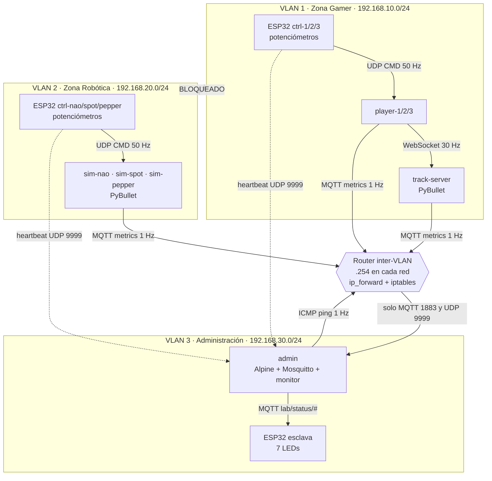
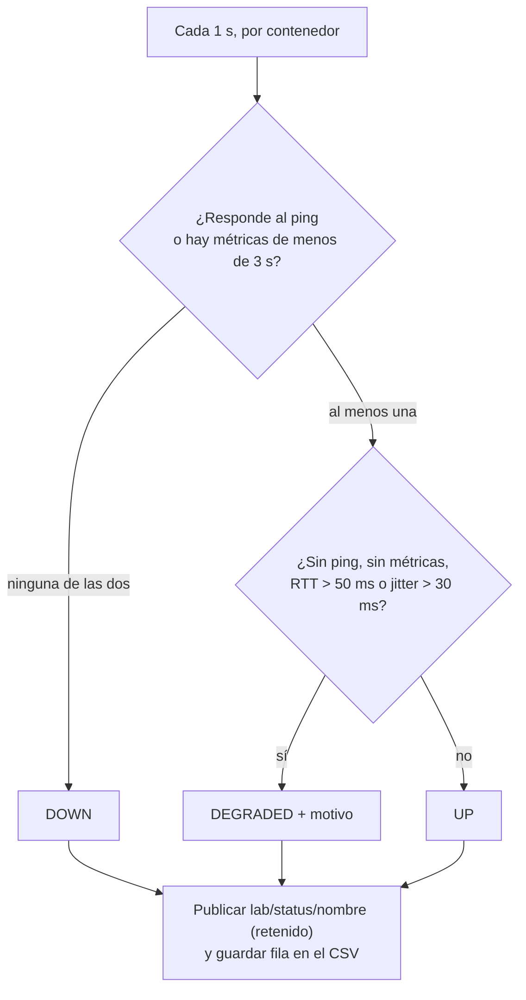

# Actividad 8 — Diseño y análisis de la arquitectura: zonas virtualizadas de simulación físico-robótica controladas por ESP32 con plano de administración de red

**Autores:** María Fernanda Peñuela Romero · Alix Estefania Maldonado Roa · Juan David Artunduaga Diaz
**Curso:** Micros y laboratorio · **Repositorio:** https://github.com/mafer1608-7/Actividad-8 · **Fecha:** 8 de octubre de 2026

> **Alcance de este documento.** No se dispuso de las placas ESP32 ni de los demás materiales físicos. Por eso este documento no reporta mediciones con hardware: **explica en detalle la arquitectura que se desarrollaría, la lógica de cada componente y las decisiones de diseño que la justifican**, y define cómo se validaría. Donde aparece un valor numérico que no fue medido (ancho de banda, presupuestos de tiempo, umbrales), se indica expresamente que es una **estimación de diseño**.

---

## Contenido

1. [Planteamiento del problema](#1-planteamiento-del-problema)
2. [Análisis de requisitos y decisiones de diseño](#2-análisis-de-requisitos-y-decisiones-de-diseño)
3. [Visión general de la arquitectura](#3-visión-general-de-la-arquitectura)
4. [Diseño de red: VLANs, direccionamiento y router](#4-diseño-de-red-vlans-direccionamiento-y-router)
5. [Capa embebida: ESP32 maestras y ESP32 esclava](#5-capa-embebida-esp32-maestras-y-esp32-esclava)
6. [Zona 1: Gamer multijugador](#6-zona-1-gamer-multijugador)
7. [Zona 2: Simulación robótica](#7-zona-2-simulación-robótica)
8. [Plano de administración](#8-plano-de-administración)
9. [Protocolos y formatos de mensaje](#9-protocolos-y-formatos-de-mensaje)
10. [Análisis de tráfico y de tiempos](#10-análisis-de-tráfico-y-de-tiempos)
11. [Análisis de fallos](#11-análisis-de-fallos)
12. [Plan de validación](#12-plan-de-validación)
13. [Materiales necesarios y sustitutos sin hardware](#13-materiales-necesarios-y-sustitutos-sin-hardware)
14. [Trazabilidad con los objetivos de la actividad](#14-trazabilidad-con-los-objetivos-de-la-actividad)
15. [Limitaciones y trabajo futuro](#15-limitaciones-y-trabajo-futuro)
16. [Conclusiones](#16-conclusiones)
17. [Referencias](#17-referencias)

---

## 1. Planteamiento del problema

En los sistemas embebidos modernos, los microcontroladores ya no operan de forma aislada: se integran con infraestructura virtualizada, redes segmentadas y simuladores físicos que replican el comportamiento de sistemas reales. La actividad pide construir un laboratorio que reúna esas piezas:

- **Microcontroladores ESP32** como dispositivos de control en tiempo real.
- **Simulación física con PyBullet**, en dos zonas: una de carreras multijugador y una de robótica.
- **Contenedores Docker**, uno por elemento simulado.
- **Segmentación por VLANs**, con las zonas aisladas entre sí.
- **Plano de administración** que mida jitter, latencia y disponibilidad.
- **Señalización física con LEDs**, controlada por una ESP32 esclava, que refleje el estado de cada contenedor.
- Un **patrón maestro–esclavo** entre los dispositivos embebidos.

### 1.1 Objetivos de la actividad

**General.** Diseñar e implementar una arquitectura distribuida basada en contenedores Docker, segmentada en VLANs, donde varias ESP32 actúan como dispositivos de control en tiempo real sobre simulaciones físicas en PyBullet, y donde un plano de administración independiente mide jitter, latencia y estado de cada zona, reflejando la actividad de los contenedores mediante LEDs controlados por una ESP32 esclava.

**Específicos.**

1. VLAN 1 (Zona Gamer Multijugador): servidor de pista en PyBullet y tres contenedores cliente, cada uno controlado por una ESP32 maestra.
2. VLAN 2 (Zona de Simulación Robótica): tres contenedores independientes (Spot, Pepper y NAO), cada uno controlado por su propia ESP32 maestra bajo el paradigma *real-to-sim*.
3. VLAN 3 (Plano de Administración): contenedor Alpine de monitoreo, broker MQTT y ESP32 esclava que señaliza con LEDs el estado de cada contenedor.
4. Router inter-VLAN que permita al plano de administración observar ambas zonas sin romper su aislamiento.
5. Validar experimentalmente el comportamiento de la red con métricas de jitter, latencia y disponibilidad.

### 1.2 Restricción del trabajo

Sin ESP32, potenciómetros ni LEDs, el objetivo es **demostrar el análisis y la lógica**: qué hace cada elemento, por qué se diseñó así, cómo se comunican y cómo se comprobaría que funciona. Cada parte física tiene un sustituto de software (sección 13) que habla el mismo protocolo, de modo que la arquitectura no cambia cuando se disponga del hardware.

---

## 2. Análisis de requisitos y decisiones de diseño

Cada requisito del enunciado se tradujo en una decisión concreta. La tabla resume el razonamiento; las secciones siguientes lo desarrollan.

| Requisito del enunciado | Decisión de diseño | Justificación |
|---|---|---|
| Zonas aisladas entre sí (VLAN 1 y VLAN 2) | Una red bridge de Docker por VLAN, con subred propia, más un router con política `DROP` por defecto | El aislamiento queda garantizado por dos mecanismos independientes: Docker separa los bridges y el router no abre ninguna regla entre las zonas |
| El plano de administración observa ambas zonas | Tercera red (VLAN 3) conectada al router, con reglas mínimas hacia y desde las zonas | Se concede solo lo necesario para medir: ICMP hacia las zonas; MQTT y heartbeat desde ellas |
| ESP32 como dispositivos de control en tiempo real | Envío UDP de control a 50 Hz con número de secuencia y marca de tiempo | UDP evita retransmisiones que retrasen datos ya obsoletos; la secuencia y la marca permiten medir pérdida y jitter |
| Un contenedor por elemento simulado | 3 clientes + 1 servidor en la VLAN 1; 3 simuladores en la VLAN 2; 1 administrador y 1 router | La caída o la saturación de un elemento no afecta a los demás y permite medir cada uno por separado |
| Paradigma *real-to-sim* | Tres entradas analógicas de la ESP32 se asignan a tres grupos de articulaciones del robot | El movimiento físico del potenciómetro se refleja directamente en la simulación |
| Medir jitter, latencia y disponibilidad | Estimador de jitter de la RFC 3550, RTT por ICMP y ventana de disponibilidad | Son definiciones estándar, calculables sin sincronizar relojes |
| LEDs que reflejen el estado de cada contenedor | MQTT con mensajes retenidos y una ESP32 esclava suscrita; fijo, parpadeo y apagado como estados | MQTT desacopla al publicador del suscriptor y el mensaje retenido da el estado actual apenas la esclava se conecta |
| Patrón maestro–esclavo | Maestras: generan las órdenes. Esclava: solo recibe estados y actúa | Separa la función de control (tiempo real) de la de señalización (supervisión) |

---

## 3. Visión general de la arquitectura

### 3.1 Capas

| Capa | Elementos | Responsabilidad |
|---|---|---|
| **Física / embebida** | 6 ESP32 maestras con potenciómetros y 1 ESP32 esclava con 7 LEDs | Adquirir la entrada del usuario y señalizar el estado |
| **Transporte** | Wi-Fi, UDP, WebSocket, MQTT, ICMP | Mover órdenes, telemetría y estados |
| **Red virtual** | 3 redes bridge de Docker y un router inter-VLAN | Segmentar y controlar el tráfico |
| **Simulación** | 1 servidor de pista, 3 clientes, 3 simuladores de robot (PyBullet) | Reproducir la física |
| **Administración** | Contenedor Alpine con broker MQTT y monitor | Medir, clasificar y publicar el estado |

### 3.2 Diagrama



### 3.3 Los tres flujos de información

El sistema se entiende mejor como tres flujos independientes que comparten la infraestructura:

1. **Flujo de control (maestras → simulación).** Cada ESP32 maestra convierte tres tensiones en un paquete UDP que llega a su contenedor. Es de alta frecuencia y no pasa por el router: nace y termina en la misma VLAN.
2. **Flujo de telemetría (simulación → administración).** Cada contenedor publica cada segundo su actividad por MQTT. Es el único flujo de las zonas que **cruza el router**.
3. **Flujo de supervisión (administración → LEDs).** El administrador combina ping, heartbeats y telemetría, decide un estado por contenedor y lo publica; la ESP32 esclava lo transforma en luz.

Esta separación es deliberada: si el flujo 3 falla, las simulaciones siguen funcionando; si el flujo 2 se interrumpe, el administrador lo detecta y lo refleja en los LEDs.

---

## 4. Diseño de red: VLANs, direccionamiento y router

### 4.1 Plan de direccionamiento

| Red | Subred | Gateway Docker | Router | Hosts |
|---|---|---|---|---|
| VLAN 1 Gamer | 192.168.10.0/24 | .1 | .254 | track-server `.10`, player-1 `.11`, player-2 `.12`, player-3 `.13` |
| VLAN 2 Robótica | 192.168.20.0/24 | .1 | .254 | sim-nao `.11`, sim-spot `.12`, sim-pepper `.13` |
| VLAN 3 Administración | 192.168.30.0/24 | .1 | .254 | admin `.10` |

Criterios del plan:

- **Una subred /24 por VLAN.** Es suficiente para cada zona y hace que cada red sea un dominio de difusión independiente.
- **El tercer octeto identifica la VLAN** (10, 20, 30), lo que permite leer la zona de cualquier dirección y escribir reglas de firewall por prefijo.
- **El router es siempre `.254`** y los servidores tienen direcciones bajas fijas: las rutas y reglas no dependen de asignación dinámica.
- **IP fijas.** El administrador conoce de antemano la dirección de cada contenedor para hacerle ping, y las reglas del router pueden nombrar al administrador (`192.168.30.10`).

### 4.2 Cómo se implementan las VLAN

Cada VLAN es una **red bridge de Docker**: un conmutador virtual con su propia subred, que aísla el tráfico de capa 2. Es una implementación lógica equivalente a una VLAN. Cuando se disponga de infraestructura física, la alternativa es crear **VLAN 802.1Q** con redes `macvlan` sobre subinterfaces etiquetadas (`eth0.10`, `eth0.20`, `eth0.30`) y un conmutador gestionable; la arquitectura de direcciones, rutas y reglas es la misma.

### 4.3 El router inter-VLAN

El router es un contenedor Alpine con **una interfaz en cada red** y el reenvío de paquetes activado. Su política es **"todo bloqueado, salvo lo estrictamente necesario"**:

```sh
iptables -P FORWARD DROP                                             # por defecto, descartar
iptables -A FORWARD -m conntrack --ctstate ESTABLISHED,RELATED -j ACCEPT   # respuestas de lo permitido
# Administración -> zonas: solo ping
iptables -A FORWARD -s 192.168.30.0/24 -d 192.168.10.0/24 -p icmp --icmp-type echo-request -j ACCEPT
iptables -A FORWARD -s 192.168.30.0/24 -d 192.168.20.0/24 -p icmp --icmp-type echo-request -j ACCEPT
# Zonas -> administrador: solo MQTT y heartbeat
iptables -A FORWARD -s 192.168.10.0/24 -d 192.168.30.10 -p tcp --dport 1883 -j ACCEPT
iptables -A FORWARD -s 192.168.10.0/24 -d 192.168.30.10 -p udp --dport 9999 -j ACCEPT
iptables -A FORWARD -s 192.168.20.0/24 -d 192.168.30.10 -p tcp --dport 1883 -j ACCEPT
iptables -A FORWARD -s 192.168.20.0/24 -d 192.168.30.10 -p udp --dport 9999 -j ACCEPT
# VLAN 1 <-> VLAN 2: no existe ninguna regla -> se aplica el DROP
```

### 4.4 Matriz de tráfico permitido

Lectura: fila = origen, columna = destino.

| Origen \ Destino | VLAN 1 | VLAN 2 | VLAN 3 (admin) |
|---|---|---|---|
| **VLAN 1** | Libre (dentro de la red) | **Bloqueado** | Solo MQTT 1883/tcp y UDP 9999 |
| **VLAN 2** | **Bloqueado** | Libre (dentro de la red) | Solo MQTT 1883/tcp y UDP 9999 |
| **VLAN 3** | Solo ICMP echo | Solo ICMP echo | Libre (dentro de la red) |

Razonamiento de cada celda:

- **VLAN 1 ↔ VLAN 2 bloqueado.** Es el requisito central de aislamiento: un fallo, saturación o intrusión en la zona de carreras no puede alcanzar a los robots y viceversa.
- **Administración → zonas, solo ICMP.** El administrador solo necesita saber si el contenedor responde y en cuánto tiempo. Cualquier otro acceso daría al plano de administración un poder que no necesita (y que, si se comprometiera, se podría usar contra las zonas).
- **Zonas → administración, solo MQTT y heartbeat.** Son los dos únicos datos que las zonas deben reportar. El administrador, además, no puede ser alcanzado por su panel web (8080) desde las zonas.
- **Las respuestas** a conexiones permitidas se aceptan por seguimiento de estado (`conntrack`), sin abrir puertos adicionales.

### 4.5 Rutas

El router solo reenvía si los hosts le envían los paquetes. Docker da a cada contenedor una puerta de enlace por defecto (la del anfitrión), que no sirve para cruzar redes. Por eso cada contenedor agrega al arrancar una **ruta estática** hacia las demás subredes a través del router:

| Contenedor | Ruta instalada |
|---|---|
| Los de la VLAN 1 | `192.168.30.0/24 via 192.168.10.254` |
| Los de la VLAN 2 | `192.168.30.0/24 via 192.168.20.254` |
| admin | `192.168.10.0/24` y `192.168.20.0/24 via 192.168.30.254` |

Las zonas **no** tienen ruta hacia la otra zona: aunque la regla del router faltara, los paquetes ni siquiera se enviarían al router. Es una segunda barrera de aislamiento. Instalar rutas requiere el permiso `NET_ADMIN` en los contenedores.

### 4.6 Cómo entran las ESP32 a las redes

Las ESP32 se conectan por Wi-Fi a la red local, no a las redes internas de Docker. Cada contenedor **publica un puerto UDP** en el PC anfitrión y la ESP32 envía sus paquetes a la IP del PC en ese puerto:

| Contenedor | Puerto en el PC | Destinatario desde la ESP32 |
|---|---|---|
| player-1 / player-2 / player-3 | UDP 5001 / 5002 / 5003 | ctrl-1 / ctrl-2 / ctrl-3 |
| sim-nao / sim-spot / sim-pepper | UDP 5011 / 5012 / 5013 | ctrl-nao / ctrl-spot / ctrl-pepper |
| admin | UDP 9999 (heartbeat), TCP 1883 (MQTT), TCP 8080 (panel) | todas las maestras / la esclava / el usuario |

---

## 5. Capa embebida: ESP32 maestras y ESP32 esclava

### 5.1 Patrón maestro–esclavo

| Rol | Dispositivos | Qué decide | Qué recibe |
|---|---|---|---|
| **Maestra** | 6 ESP32 (3 por zona) | Genera las órdenes de control a partir de los potenciómetros | Nada del sistema; solo emite |
| **Esclava** | 1 ESP32 | Nada: obedece | El estado de cada contenedor, por MQTT |

La relación es **uno a uno** entre cada maestra y su contenedor: una maestra controla un contenedor y no conoce a los demás. La esclava solo conoce el broker.

### 5.2 ESP32 maestra

**Entradas.** Tres potenciómetros de 10 kΩ, uno por canal, con un extremo a 3V3, otro a GND y el cursor al pin analógico. La tensión del cursor es proporcional al giro.

**Elección de pines.** Se usan los GPIO **34, 35 y 32**, que pertenecen al convertidor **ADC1**. En la ESP32, el ADC2 no puede usarse mientras el Wi-Fi está activo, y todas las maestras usan Wi-Fi; por eso se eligió ADC1. Los GPIO 34 y 35 son solo de entrada, lo que además evita configurarlos por error como salida.

**Adquisición.** El ADC trabaja a 12 bits (0 a 4095). Cada canal se lee **cuatro veces y se promedia** antes de usarse, para reducir el ruido del convertidor.

**Ciclo de envío.** Un bucle sin bloqueos controla dos temporizadores:

```text
cada 20 ms  (50 Hz):  CMD,<id>,<seq>,<millis>,<v1>,<v2>,<v3>   -> contenedor de su zona
cada 100 ms (10 Hz):  HB,<id>,<seq>,<millis>                    -> administrador (UDP 9999)
```

```text
repetir:
    ahora ← millis()
    si ahora − últimoCMD ≥ 20:
        últimoCMD ← últimoCMD + 20             # cadencia estable, sin deriva acumulada
        si aún se está atrasado, últimoCMD ← ahora
        v1,v2,v3 ← promedio de 4 lecturas de cada ADC
        enviar UDP "CMD,id,seq++,ahora,v1,v2,v3"
    si ahora − últimoHB ≥ 100:
        … enviar UDP "HB,id,seq++,ahora"
    si el Wi-Fi se perdió: reconectar
```

**Por qué 50 Hz.** El movimiento de una mano sobre un potenciómetro tiene componentes por debajo de unos 10 Hz; muestrear a 50 Hz (cinco veces más) captura el movimiento sin pérdida y da al simulador una orden nueva cada 20 ms, menos que un paso de control del simulador (33 ms a 30 Hz). Frecuencias mayores aumentarían el tráfico sin mejorar el control.

**Por qué un heartbeat aparte.** El paquete `CMD` va al contenedor de su zona y nunca cruza el router; el `HB` va al administrador y **sí lo cruza**. Medir el jitter sobre `HB` evalúa precisamente el camino que pasa por el plano de administración, y además sigue existiendo aunque el contenedor destino de `CMD` esté caído.

**Por qué secuencia y marca de tiempo.** El número de secuencia permite detectar paquetes perdidos (huecos). La marca de tiempo (`millis` del emisor) permite calcular el jitter comparando el espaciado de llegada con el espaciado de salida, sin necesidad de que los relojes del emisor y del receptor estén sincronizados.

**Ajustes de Wi-Fi.** El ahorro de energía del Wi-Fi se desactiva: de lo contrario la radio duerme entre balizas y los paquetes se agrupan, lo que aumenta el jitter. El LED integrado (GPIO 2) indica que hay conexión.

**Una sola programación, seis dispositivos.** Todas las maestras ejecutan el mismo código; solo cambian el identificador (`ctrl-1`, …, `ctrl-pepper`) y el puerto de destino, definidos al compilar.

### 5.3 ESP32 esclava

**Salidas.** Siete LED, cada uno con una resistencia de 220 Ω hacia GND. Con 3.3 V y un LED de unos 2 V, la corriente es (3.3 − 2) / 220 ≈ 6 mA, segura para el pin (máx. recomendado ≈ 12 mA) y suficiente para verse.

| LED | GPIO | Contenedor |
|---|---|---|
| 1 | 13 | track-server |
| 2 | 14 | player-1 |
| 3 | 16 | player-2 |
| 4 | 17 | player-3 |
| 5 | 18 | sim-nao |
| 6 | 19 | sim-spot |
| 7 | 21 | sim-pepper |

Se evitan los pines de arranque de la ESP32 (0, 2, 5, 12 y 15), cuyo nivel al encender condiciona el modo de inicio, para que un LED conectado no impida arrancar la placa.

**Lógica.**

```text
al iniciar:     encender cada LED un instante (prueba de LEDs)
conectar al Wi-Fi y al broker; suscribirse a  lab/status/#
al llegar un mensaje en lab/status/<nombre>:
        estado[nombre] ← UP | DEGRADED | DOWN ;  últimoVisto[nombre] ← ahora
en cada vuelta del bucle, para cada LED:
        si no hay broker:                 parpadeo rápido (5 Hz)
        si no hay mensaje en 5 s:         estado = DOWN
        UP        → encendido fijo
        DEGRADED  → parpadeo de 2 Hz
        DOWN      → apagado
```

**Decisiones de seguridad (fail-safe).** Un LED apagado solo debe significar "caído" o "sin información", nunca "todo bien". Por eso: (a) si no llegan mensajes de un contenedor durante 5 s, se considera `DOWN`; (b) si se pierde el broker, **todos** los LED parpadean rápido, indicando que la propia señalización no es confiable. Así un fallo del plano de administración no se confunde con un funcionamiento normal.

**Mensajes retenidos.** El administrador publica con la bandera *retain*: el broker guarda el último estado de cada contenedor y se lo entrega a la esclava en cuanto se suscribe, sin esperar al siguiente segundo.

---

## 6. Zona 1: Gamer multijugador

### 6.1 Componentes

| Contenedor | IP | Función |
|---|---|---|
| `track-server` | 192.168.10.10 | Mundo PyBullet con la pista y los 3 coches |
| `player-1/2/3` | 192.168.10.11–13 | Puente entre su ESP32 y el servidor; define el color y el estilo del coche |

### 6.2 Por qué hay un cliente por jugador

Si la ESP32 hablara directamente con el servidor, este tendría que entender tres fuentes de control, tres formatos y tres cadenas de fallos. Con un contenedor cliente por jugador:

- La **traducción** de valores del potenciómetro a dirección y acelerador queda aislada en el cliente.
- Se puede **medir cada jugador por separado** (cada cliente publica su jitter y su tasa), y detectar si uno falla.
- El servidor tiene una **interfaz única** (WebSocket) independiente del origen del control: mañana podría ser un joystick, un navegador o un agente de aprendizaje por refuerzo.

### 6.3 Lógica del cliente

1. Recibe `CMD` por UDP y lo valida (formato y campos numéricos); los paquetes inválidos se cuentan.
2. Conserva el último par `(v1, v2)` con su instante de llegada.
3. Cada 1/30 s construye el mensaje WebSocket:

```text
dirección  steer    = (v1 − 2048) / 2048          → rango [−1, 1], 0 = recto
           si |steer| < 0.05  →  steer = 0        # zona muerta: ignora el ruido del potenciómetro en el centro
acelerador throttle = v2 / 4095                    → rango [0, 1]
```

4. Si el último `CMD` tiene más de 0.5 s, **no envía comando de control**: manda solo un mensaje de mantenimiento (`idle`). Así el servidor sabe que el jugador sigue conectado pero no está controlando.
5. Cada mensaje lleva también el **color** (`CAR_COLOR`, RGB 0–1), el **estilo** (`CAR_STYLE`) y la **ganancia** asociada al estilo:

| Estilo | Ganancia de velocidad | Efecto |
|---|---|---|
| `classic` | 0.7 | Más lento y estable |
| `sport` | 1.0 | Velocidad base |
| `drift` | 1.2 | Más rápido; más propenso a derrapar |

6. Si se pierde la conexión con el servidor, el cliente la reintenta cada segundo sin detenerse.

### 6.4 Lógica del servidor de pista

**Mundo.** PyBullet sin interfaz gráfica, a **240 Hz** (paso de 4.17 ms) con gravedad y un plano. La pista es una **elipse de semiejes 10 m y 6 m**, descrita por **48 waypoints**:

```text
x_k = 10 · cos(2π·k / 48)        y_k = 6 · sin(2π·k / 48)        k = 0 … 47
```

**Coches.** Tres modelos `racecar`, colocados en waypoints separados 16 posiciones (48 / 3), de modo que parten repartidos por la pista y orientados según la tangente. Cada coche tiene motores en las ruedas (control de velocidad) y en la dirección (control de posición).

**Aplicación del control.** Cada 4 pasos de física (60 Hz):

```text
velocidad de rueda = throttle · ganancia · 40 rad/s        (fuerza máxima 20)
ángulo de dirección = steer · 0.5 rad                       (≈ ±28.6°)
```

**Modo humano o automático.** Si llegó un comando de control en el último segundo, el coche obedece al jugador (`HUMAN`). Si no, pasa a **piloto automático** (`AUTO`), que es lo que cumple el requisito de "carros autónomos" del servidor:

```text
j     ← waypoint más cercano a la posición actual
(tx,ty) ← waypoint (j + 3) mod 48          # apunta 3 waypoints por delante
error ← atan2(ty − y, tx − x) − yaw        # diferencia de rumbo, normalizada a [−π, π]
steer ← clip(1.5 · error, −1, 1)           # control proporcional con ganancia 1.5
throttle ← 0.5                             # velocidad moderada
```

Apuntar 3 waypoints adelante (en lugar del más cercano) suaviza la trayectoria; el controlador proporcional corrige el rumbo de forma continua, sin oscilaciones apreciables a la velocidad usada.

**Eventos.** Si la ESP32 de un jugador se apaga, su coche pasa solo a `AUTO` en 1 s y retoma el control humano cuando vuelven los comandos: el juego **degrada con gracia** en vez de detenerse.

### 6.5 Telemetría de la zona

Cada segundo, el servidor publica su frecuencia real de simulación (`sim_hz`, que debería ser ≈ 240) y el modo y posición de cada coche; cada cliente publica su tasa de paquetes, jitter y pérdidas y si está conectado al servidor. Todo lo recibe el administrador (sección 8).

---

## 7. Zona 2: Simulación robótica

### 7.1 Componentes

| Contenedor | IP | Robot | Referencia |
|---|---|---|---|
| `sim-spot` | 192.168.20.12 | Cuadrúpedo | [rex-gym](https://github.com/nicrusso7/rex-gym) |
| `sim-nao` | 192.168.20.11 | Humanoide pequeño | [humanoid-gym](https://github.com/0aqz0/humanoid-gym) |
| `sim-pepper` | 192.168.20.13 | Humanoide grande | [humanoid-gym](https://github.com/0aqz0/humanoid-gym) |

Cada robot está en **su propio contenedor, con su propio proceso PyBullet y su propia ESP32**, como exige el enunciado: son tres simulaciones independientes. No hay servidor central ni comunicación entre robots, lo que simplifica el análisis y mantiene a cada uno aislado de los fallos de los otros.

### 7.2 Paradigma *real-to-sim*

*Real-to-sim* significa que **un dispositivo físico gobierna a su gemelo simulado**: el usuario mueve algo real y el robot virtual lo reproduce. En este diseño, el "dispositivo real" es la ESP32 con sus tres potenciómetros.

### 7.3 Mapeo de entradas a articulaciones

Un robot tiene decenas de articulaciones y la ESP32 solo ofrece tres entradas. La solución es agrupar:

1. Al cargar el modelo se recorren todas las articulaciones y se conservan las **rotacionales con límites válidos** (límite inferior < superior).
2. Se reparten **cíclicamente en tres grupos**: la articulación `k` va al grupo `k mod 3`. Así cada grupo mezcla articulaciones de distintas partes del cuerpo y el robot "se mueve completo" con cada potenciómetro.
3. Cada valor `v` (0–4095) fija la **posición objetivo** de todas las articulaciones de su grupo, interpolando entre sus límites:

```text
fracción = clip(v / 4095, 0, 1)
objetivo = límite_inferior + (límite_superior − límite_inferior) · fracción
```

Con el potenciómetro en un extremo, las articulaciones del grupo quedan en su límite inferior; en el otro, en el superior; en el centro, a mitad de su rango.

### 7.4 Lógica del simulador

```text
física a 240 Hz (paso de 4.17 ms)
hilo aparte: recibe UDP "CMD", valida, guarda (v1,v2,v3) y actualiza el jitter
cada 8 pasos (30 Hz): aplicar posición objetivo a cada articulación (control por posición, fuerza 50)
cada 1 s: publicar métricas por MQTT
```

- **Recepción en un hilo aparte**, para que escuchar la red nunca retrase un paso de la física.
- **Control a 30 Hz, física a 240 Hz.** Ordenar a los motores más rápido que lo que las órdenes cambian (50 Hz como máximo) no aporta nada; y los pasos intermedios de la física suavizan el movimiento.
- **Si no llegan paquetes**, el robot **mantiene la última posición** (el control por posición sigue activo): no cae ni da saltos. La métrica `cmd_age_s` indica hace cuánto no se recibe una orden.
- **Base fija.** Por defecto la base del robot está sujeta a un punto en el aire. Un humanoide con articulaciones moviéndose sin controlador de equilibrio se caería de inmediato; sujetarlo hace visible el *real-to-sim* sin involucrar el problema (distinto) de la locomoción. Se puede liberar para experimentos.

### 7.5 Modelos de robot

| Robot | Modelo usado por defecto | Alternativa |
|---|---|---|
| Spot | `a1` de `pybullet_data` (cuadrúpedo de 12 articulaciones) | Modelo de rex-gym |
| NAO | `humanoid` de `pybullet_data`, escalado a ≈ 0.33 | Modelo de humanoid-gym |
| Pepper | `humanoid` de `pybullet_data`, escalado a ≈ 0.70 | Modelo de humanoid-gym |

Los modelos por defecto permiten que el contenedor funcione sin descargas adicionales. Para usar los de los repositorios de referencia basta con montarlos en el contenedor e indicar su ruta: el mapeo por grupos se adapta solo a las articulaciones que encuentre.

---

## 8. Plano de administración

### 8.1 Componentes

El contenedor `admin` (Alpine Linux) reúne tres funciones: el **broker MQTT** (Mosquitto), el **monitor** que mide y decide, y un **panel web** de visualización. La ESP32 esclava se conecta a su broker.

El monitor trabaja con **cuatro tareas en paralelo**:

| Tarea | Frecuencia | Qué hace |
|---|---|---|
| Pinger | 1 Hz | Lanza `ping` a los 7 contenedores a la vez y guarda el RTT (o ausencia) |
| Receptor de heartbeats | continuo | Escucha el UDP 9999 y actualiza las estadísticas de cada ESP32 maestra |
| Cliente MQTT | continuo | Recibe `metrics/#` de los contenedores y guarda la última métrica y cuándo llegó |
| Evaluador | 1 Hz | Calcula el estado de cada contenedor, lo publica y lo guarda en el CSV |

### 8.2 Definición de las métricas

**Latencia (RTT).** Tiempo de ida y vuelta de un `ping` ICMP al contenedor, en ms. Si no hay respuesta en 1 s, se registra como ausencia.

**Jitter.** Para cada paquete `i` con número de secuencia y marca de tiempo del emisor `t_i`, llegado en el instante `r_i`:

```text
D(i) = | (r_i − r_(i−1)) − (t_i − t_(i−1)) |
J    ← J + (D(i) − J) / 16
```

`D(i)` compara el tiempo que pasó entre dos llegadas con el tiempo que pasó entre las dos salidas. Si la red no altera el espaciado, `D = 0`. El factor 1/16 convierte `D` en un **promedio móvil exponencial** que suaviza picos aislados (valor tomado de la RFC 3550). Como solo usa diferencias, no necesita que el reloj de la ESP32 y el del PC coincidan. Si la secuencia **retrocede** (la ESP32 se reinició), se descarta la referencia anterior para no contar un falso jitter.

**Pérdida.** `pérdidas += seq_nuevo − seq_anterior − 1` cada vez que la secuencia salta más de 1.

**Tasa de paquetes.** Paquetes recibidos en una ventana deslizante de 2 s, dividido entre 2.

**Disponibilidad.**

```text
disponibilidad (%) = 100 · (pings respondidos en las últimas 300 muestras) / (muestras)
```

Una ventana de 300 muestras a 1 Hz equivale a unos 5 minutos: suficientemente larga para no reaccionar a un solo ping perdido y suficientemente corta para reflejar un problema reciente.

### 8.3 Clasificación del estado

Cada segundo, para cada contenedor, se combinan **dos fuentes independientes de evidencia**:

- **Evidencia de red:** ¿responde al ping, y en cuánto tiempo?
- **Evidencia de actividad:** ¿llegó una métrica MQTT en los últimos 3 s?, ¿qué jitter reportan el contenedor y su ESP32?



Tabla de decisión completa:

| ¿Ping responde? | ¿Métricas recientes? | Otras condiciones | Estado | Motivo |
|---|---|---|---|---|
| Sí | Sí | RTT ≤ 50 ms y jitter ≤ 30 ms | `UP` | — |
| Sí | Sí | RTT > 50 ms | `DEGRADED` | `latencia-alta` |
| Sí | Sí | Jitter > 30 ms | `DEGRADED` | `jitter-alto` |
| Sí | No | — | `DEGRADED` | `sin-metricas` (la red responde, pero la simulación no reporta: proceso detenido o ruta MQTT cortada) |
| No | Sí | — | `DEGRADED` | `sin-ping` (la simulación reporta, pero el camino ICMP falla) |
| No | No | — | `DOWN` | contenedor o enlace caído |

**Por qué dos señales.** Con una sola, los fallos parciales serían invisibles o se confundirían con una caída total. Un contenedor puede responder al ping y tener la simulación congelada (solo lo revela la falta de métricas) o seguir simulando con la red muy lenta (solo lo revela el RTT). `DOWN` se reserva para cuando **ambas** señales fallan.

**Origen de los umbrales (estimaciones de diseño).**

| Umbral | Valor | Razón |
|---|---|---|
| RTT | 50 ms | En una red local el RTT esperado es de pocos milisegundos; 50 ms ya es un deterioro claro y está por debajo de lo perceptible en el control (una orden cada 20 ms) |
| Jitter | 30 ms | Uno y medio veces el periodo de envío de 20 ms: una variación mayor hace que las órdenes lleguen desordenadas o acumuladas |
| Frescura de métricas | 3 s | Tres periodos de publicación (1 Hz): tolera la pérdida de uno o dos mensajes sin alarmar |

Los tres umbrales son **configurables** al iniciar el contenedor.

### 8.4 Publicación y registro

| Destino | Contenido | Uso |
|---|---|---|
| `lab/status/<nombre>` (retenido) | `UP`, `DEGRADED` o `DOWN` | La ESP32 esclava y cualquier otro suscriptor |
| `lab/metrics/<nombre>` | JSON con RTT, jitter, pérdida, tasa, frecuencia de simulación, disponibilidad y motivos | Panel y análisis |
| Archivo CSV | Una fila por contenedor y por segundo con marca de tiempo, estado y métricas | Análisis posterior de los experimentos (media, p95, máximos) |
| Panel web (puerto 8080) | Tabla de los 7 contenedores con colores por estado, actualizada cada segundo | Observación en vivo |

---

## 9. Protocolos y formatos de mensaje

### 9.1 Resumen

| Enlace | Protocolo | Formato | Frecuencia |
|---|---|---|---|
| ESP32 maestra → contenedor | UDP | `CMD,id,seq,ms,v1,v2,v3` | 50 Hz |
| ESP32 maestra → administrador | UDP, puerto 9999 | `HB,id,seq,ms` | 10 Hz |
| player → track-server | WebSocket | JSON `{player, steer, throttle, color, style, gain}` | 30 Hz |
| Contenedor → administrador | MQTT `metrics/<nombre>` | JSON | 1 Hz |
| Administrador → esclava | MQTT `lab/status/<nombre>` | `UP`, `DEGRADED` o `DOWN` (retenido) | 1 Hz |
| Administrador → panel | MQTT `lab/metrics/<nombre>` y HTTP | JSON | 1 Hz |
| Administrador → contenedores | ICMP | `ping` | 1 Hz |

### 9.2 Por qué cada protocolo

| Protocolo | Dónde | Razón |
|---|---|---|
| **UDP** | Control y heartbeat | Es en tiempo real: un dato viejo no vale la pena retransmitirlo, porque 20 ms después llega uno nuevo. Además el encabezado mínimo y la ausencia de conexión permiten a una ESP32 enviarlo sin carga |
| **WebSocket** | Cliente → servidor de pista | Conexión persistente y bidireccional sobre TCP, adecuada para un flujo continuo entre procesos PC; entrega ordenada |
| **MQTT** | Telemetría y estado | Publicación/suscripción: el administrador no necesita conocer a la esclava ni los contenedores conocer al administrador más que por su tópico. Los mensajes retenidos resuelven el estado inicial |
| **ICMP** | Latencia y disponibilidad | Medición independiente de la aplicación: responde aunque la simulación esté detenida |

### 9.3 Ejemplo de mensajes

```text
$ CMD,ctrl-1,1042,52110,2048,3100,1500        # ESP32 maestra del jugador 1
$ HB,ctrl-1,521,52100
{"player":1,"steer":0.0,"throttle":0.757,"color":[0,0.2,1],"style":"sport","gain":1.0}
metrics/player-1   {"rx":3010,"lost":0,"jitter_ms":2.1,"rate_hz":50.0,"ws_connected":true,...}
lab/status/player-1   UP
```

---

## 10. Análisis de tráfico y de tiempos

> Todos los valores de esta sección son **estimaciones de diseño** calculadas a partir del tamaño de los mensajes y sus frecuencias; no son mediciones.

### 10.1 Ancho de banda

| Flujo | Tamaño aprox. | Frecuencia | Por dispositivo |
|---|---|---|---|
| `CMD` (ESP32 → contenedor) | 40 B | 50 Hz | ≈ 2 KB/s |
| `HB` (ESP32 → administrador) | 22 B | 10 Hz | ≈ 0.2 KB/s |
| Métricas MQTT (contenedor → administrador) | ≈ 250 B | 1 Hz | ≈ 0.25 KB/s |
| Estados y métricas publicados por el administrador | ≈ 350 B por contenedor | 1 Hz | ≈ 2.5 KB/s en total |

Con 6 maestras y 7 contenedores:

```text
control  : 6 · 2.2 KB/s ≈ 13 KB/s
telemetría: 7 · 0.25 KB/s ≈ 1.8 KB/s
estados  :                  ≈ 2.5 KB/s
total    :                  ≈ 17 KB/s ≈ 0.14 Mbit/s
```

Una red Wi-Fi 802.11n entrega varios Mbit/s: el sistema usa **menos del 5 %** de su capacidad, de modo que la congestión no es el factor limitante y los efectos que se midan en los experimentos serán debidos a las perturbaciones inyectadas y no a la carga propia.

### 10.2 Presupuesto de retardo de extremo a extremo (potenciómetro → movimiento simulado)

| Etapa | Retardo estimado |
|---|---|
| Lectura del ADC y promedio | < 1 ms |
| Espera hasta el siguiente envío (periodo de 20 ms) | 0 – 20 ms |
| Wi-Fi y pila de red (ESP32 → PC) | 2 – 10 ms |
| Entrega al contenedor y proceso del paquete | < 5 ms |
| Espera al siguiente ciclo de control (33 ms a 30 Hz; en la zona Gamer, además, el reenvío WebSocket) | 0 – 33 ms |
| Un paso de física | ≈ 4 ms |
| **Total típico** | **≈ 10 – 70 ms** |

Es inferior a los ≈ 100 ms en los que una persona empieza a percibir retraso entre su gesto y la respuesta, por lo que el sistema se percibe como inmediato. El mayor aporte son las esperas de muestreo, no la red.

### 10.3 Carga de cálculo

Las ESP32 solo leen ADC y arman una cadena de texto cada 20 ms, una fracción mínima de su capacidad. El costo está en las simulaciones, que en el PC corren a 240 Hz: son 7 procesos de física (3 coches comparten uno) más el administrador. Si un proceso no alcanza los 240 Hz, lo revela la métrica `sim_hz`, que aparece en el panel como señal de saturación del anfitrión y no de la red.

---

## 11. Análisis de fallos

Se estudia qué pasaría ante cada falla, cuál sería el efecto en las simulaciones y cómo se vería en el administrador y en los LEDs.

| Falla | Efecto en la simulación | Lo que ve el administrador | LED |
|---|---|---|---|
| **Se apaga una ESP32 maestra de la zona Gamer** | Su coche pasa a `AUTO` tras 1 s y sigue en pista | Faltan sus heartbeats; el contenedor `player` sigue `UP` pero su tasa de paquetes cae a 0 | Fijo (el contenedor está sano) |
| **Se apaga una ESP32 maestra de un robot** | El robot mantiene su última posición | Igual: tasa 0 y sin heartbeats; `cmd_age_s` crece | Fijo |
| **Cae un contenedor** (`docker stop`) | Esa simulación desaparece; las demás siguen | Sin ping y sin métricas → `DOWN`; la disponibilidad baja | Apagado |
| **Se detiene el proceso de simulación, pero el contenedor sigue vivo** | La simulación se congela | Hay ping pero no métricas → `DEGRADED` (`sin-metricas`) | Parpadeo lento |
| **Latencia alta en una VLAN** | Las órdenes llegan con retraso | RTT > 50 ms → `DEGRADED` (`latencia-alta`) en todos los contenedores de esa VLAN | Parpadeo lento en esa zona |
| **Jitter alto en una maestra** | Movimiento a tirones | Jitter > 30 ms → `DEGRADED` (`jitter-alto`) en su contenedor | Parpadeo lento |
| **Cae el router** | Las zonas siguen funcionando (el control no pasa por el router) | El administrador pierde ping y métricas de todos → todos `DOWN` | Todos apagados |
| **Cae el broker MQTT** | Sin efecto en las simulaciones | Los contenedores no pueden publicar | La esclava pierde el broker: todos parpadean rápido |
| **Se pierde el Wi-Fi de la esclava** | Sin efecto | Sin efecto (publica igual) | Todos parpadean rápido o se apagan tras 5 s |
| **Intento de acceso entre zonas** | — | Bloqueado por el router; los contadores de `iptables` aumentan | — |

**Observaciones del análisis.**

- La arquitectura **separa el plano de control del plano de supervisión**: las fallas del segundo no detienen al primero. Un router caído deja ciego al administrador, pero no detiene las simulaciones.
- Un LED **fijo no garantiza que el jugador o el robot estén siendo controlados**, solo que el contenedor está sano. La presencia o ausencia de control se ve en la tasa de paquetes y en los heartbeats.
- El caso "contenedor vivo, simulación congelada" es el que justifica combinar ping y métricas: el ping solo no lo detectaría.

---

## 12. Plan de validación

Los experimentos se diseñaron con **hipótesis y criterio de aceptación**; cada uno se ejecutaría con las ESP32 físicas o, mientras tanto, con ESP32 virtuales que envían los mismos paquetes (sección 13).

| Exp. | Hipótesis | Procedimiento | Medida | Criterio de aceptación |
|---|---|---|---|---|
| **E0** Aislamiento | La VLAN 1 y la VLAN 2 no se alcanzan; el administrador alcanza ambas | Ping desde `player-1` a `sim-nao`; ping desde `admin` a ambas zonas; intentar acceder al panel (8080) desde una zona | Respuesta de cada intento y contadores del firewall | VLAN1↔VLAN2 sin respuesta; admin→zonas con respuesta; zona→8080 bloqueado |
| **E1** Línea base | Sin perturbaciones, todos los contenedores están sanos | 5 minutos con las 6 maestras enviando | Estado, RTT, jitter y disponibilidad por contenedor | Los 7 en `UP`, disponibilidad ≈ 100 %, RTT y jitter por debajo de los umbrales |
| **E2** Latencia | Añadir 100 ms ± 20 ms a una VLAN degrada a sus contenedores | Aplicar retardo de red (`tc netem`) en la interfaz del router hacia la VLAN 2 durante 1 minuto y luego quitarlo | RTT, estado y LED | Los 3 simuladores pasan a `DEGRADED` (`latencia-alta`) y vuelven a `UP` al quitar el retardo; la VLAN 1 no se ve afectada |
| **E3** Jitter y pérdida | Un emisor con variación de tiempos y pérdidas sube el jitter medido | Una maestra envía con retardo aleatorio de hasta 80 ms y 10 % de paquetes descartados | Jitter, pérdidas, estado | Jitter > 30 ms, pérdidas ≈ 10 %, su contenedor en `DEGRADED` (`jitter-alto`) |
| **E4** Disponibilidad | Detener un contenedor lo pone en `DOWN` y la disponibilidad lo refleja | Detener `sim-spot` 30 s y reiniciarlo | Estado, disponibilidad, LED | `DOWN` en ≈ 3 s, LED apagado; vuelta a `UP` tras reiniciar; disponibilidad ≈ 90 % en esa ventana |
| **E5** Aislamiento bajo perturbación | El aislamiento se mantiene mientras hay latencia inyectada | Repetir E0 durante E2 | Igual que E0 | Mismo resultado que E0 |

**Análisis de los datos.** El CSV del administrador se procesa por contenedor y por experimento (aislando el intervalo de tiempo), calculando el porcentaje de tiempo en cada estado, RTT medio, percentil 95 y máximo, y jitter medio y máximo. El percentil 95 es la medida clave de la latencia, porque la media oculta los picos.

### 12.1 Comprobaciones ya realizadas

Se verificó, con pruebas locales sin Docker ni ESP32, la **lógica del administrador** y el **estimador de jitter**:

| Prueba | Entrada | Resultado |
|---|---|---|
| Clasificación | Ping de 3.2 ms y métricas recientes | `UP` |
| Clasificación | Ping de 120 ms | `DEGRADED` |
| Clasificación | Sin ping y sin métricas | `DOWN` |
| Estimador de jitter | 50 paquetes con periodo base de 20 ms y retardo aleatorio de 0 a 10 ms | 50 recibidos, 0 perdidos, jitter estimado de 4.9 ms |

Las mediciones de los experimentos E0 a E5 con el sistema completo **están pendientes** de ejecutar y no se reportan resultados en este documento.

---

## 13. Materiales necesarios y sustitutos sin hardware

| Elemento | Cant. | Función | Sustituto cuando no está disponible |
|---|---|---|---|
| ESP32 DevKit (maestras) | 6 | Leer los potenciómetros y enviar el control | **ESP32 virtual**: un programa que envía los mismos `CMD` y `HB` (señales senoidales en lugar de potenciómetros), con parámetros para inyectar jitter y pérdidas |
| ESP32 DevKit (esclava) | 1 | Mostrar el estado con LEDs | Suscripción MQTT a `lab/status/#` desde el PC (los mismos mensajes que recibiría la placa); el panel web del administrador |
| Potenciómetros 10 kΩ | 18 | Entradas analógicas | Valores senoidales generados por la ESP32 virtual |
| LED + resistencias de 220 Ω | 7 + 7 | Señalización | Los colores del panel web (verde, amarillo, rojo) |
| Protoboard, cables Dupont y USB | los necesarios | Montaje y alimentación | No aplica |
| PC con Docker y Wi-Fi 2.4 GHz | 1 | Redes, router, simulaciones y administrador | Todo el laboratorio corre en el PC |

**Qué cambia y qué no con los sustitutos.** El sustituto es **exactamente el mismo protocolo** que usaría la placa real. Los contenedores, el router, el administrador y los experimentos no distinguen entre una ESP32 física y una virtual. Lo que no se puede reproducir sin hardware es el **comportamiento de la radio Wi-Fi real**, que determina la latencia y el jitter reales: por eso las mediciones con placas físicas siguen siendo necesarias para una validación completa.

---

## 14. Trazabilidad con los objetivos de la actividad

| Objetivo | Elementos del diseño | Sección | Criterio de comprobación |
|---|---|---|---|
| **1.** VLAN 1: servidor de pista y tres clientes controlados por ESP32 maestras | track-server, player-1/2/3, 3 maestras, piloto automático | 6 | E1, E3 |
| **2.** VLAN 2: Spot, Pepper y NAO independientes, *real-to-sim* | sim-spot, sim-nao, sim-pepper, mapeo de 3 entradas a 3 grupos de articulaciones | 7 | E1, E2 |
| **3.** VLAN 3: administrador Alpine, broker MQTT y esclava con LEDs | admin, Mosquitto, monitor, esclava con 7 LEDs, estados `UP/DEGRADED/DOWN` | 5.3, 8 | E1, E4 |
| **4.** Router inter-VLAN sin romper el aislamiento | Router con política `DROP`, rutas estáticas, reglas mínimas | 4 | E0, E5 |
| **5.** Validación con jitter, latencia y disponibilidad | Estimador de jitter, RTT, ventana de disponibilidad, CSV, experimentos | 8.2, 12 | E1–E5 |
| **General.** Maestro–esclavo, contenedores, VLANs, jitter y LEDs | Arquitectura completa | 3 | — |

---

## 15. Limitaciones y trabajo futuro

**Limitaciones del diseño.**

- Las VLAN son redes bridge de Docker (equivalentes lógicas); no hay etiquetado 802.1Q.
- El broker MQTT es anónimo y sin cifrado, apropiado para un laboratorio.
- Cada ESP32 usa el Wi-Fi del PC anfitrión; el comportamiento real del enlace inalámbrico no se pudo caracterizar.
- Los robots usan modelos de `pybullet_data` y base fija; no hay locomoción ni equilibrio.
- Los umbrales de estado son estimaciones de diseño; con mediciones reales de la línea base conviene recalibrarlos (por ejemplo, fijarlos en la media más varias desviaciones típicas).
- No hay resultados experimentales con el sistema completo.

**Trabajo futuro.**

- Ejecutar los experimentos E0–E5 con las ESP32 físicas y comparar con las ESP32 virtuales.
- Usar los modelos originales de rex-gym y humanoid-gym, y añadir locomoción.
- Reemplazar el piloto automático por una política de aprendizaje por refuerzo (rl-baselines3-zoo).
- Autenticación, control de acceso (ACL) y TLS en MQTT.
- VLAN 802.1Q reales con `macvlan` y enrutamiento dinámico con FRR.
- Paneles históricos (por ejemplo, Grafana) sobre el CSV de métricas.

---

## 16. Conclusiones

- La arquitectura convierte los requisitos del enunciado en decisiones verificables: cada VLAN es una red independiente, el router solo abre tres excepciones y el aislamiento entre zonas se garantiza por **dos mecanismos independientes** (reglas del router y ausencia de rutas).
- Separar los flujos de **control**, **telemetría** y **supervisión** hace que el sistema degrade con gracia: una falla del plano de administración no detiene las simulaciones, y una falla de una ESP32 maestra no detiene al resto (el coche pasa a automático y el robot mantiene su pose).
- Combinar varias señales (ping, métricas MQTT y heartbeats) permite distinguir tres situaciones que un solo indicador confundiría: contenedor sano, degradado y caído, e indicar el motivo.
- El estimador de jitter de la RFC 3550 es apropiado para este caso porque trabaja con diferencias y no exige sincronizar relojes entre microcontroladores y PC.
- La ESP32 esclava se diseñó con comportamiento seguro: un LED apagado nunca significa "todo bien", y la pérdida del broker se señala con un patrón propio.
- Con ESP32 virtuales que usan el mismo protocolo, el diseño se puede validar por completo sin el hardware; lo que queda por medir con placas reales es el comportamiento de la radio Wi-Fi.

---

## 17. Referencias

- Schulzrinne, H., Casner, S., Frederick, R., & Jacobson, V. (2003). *RTP: A Transport Protocol for Real-Time Applications*, RFC 3550 (estimador de jitter).
- OASIS. *MQTT Version 3.1.1*; Eclipse Mosquitto. https://mosquitto.org
- Coumans, E., & Bai, Y. *PyBullet, a Python module for physics simulation for games, robotics and machine learning*. https://pybullet.org
- Docker Inc. *Networking overview* y *Docker Compose*. https://docs.docker.com
- Netfilter Project. *iptables* y *tc-netem*.
- Espressif Systems. *ESP32 Technical Reference Manual* (ADC1/ADC2, pines de arranque) y documentación de Arduino-ESP32.
- Raffin, A. et al. *RL Baselines3 Zoo*. https://github.com/DLR-RM/rl-baselines3-zoo
- Russo, N. *rex-gym*. https://github.com/nicrusso7/rex-gym
- *humanoid-gym*. https://github.com/0aqz0/humanoid-gym
